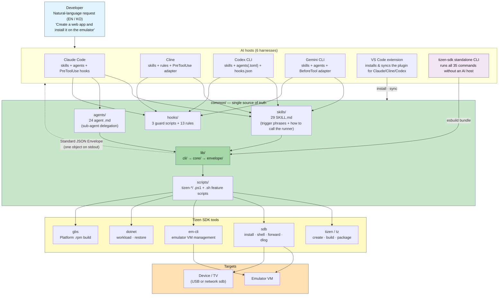
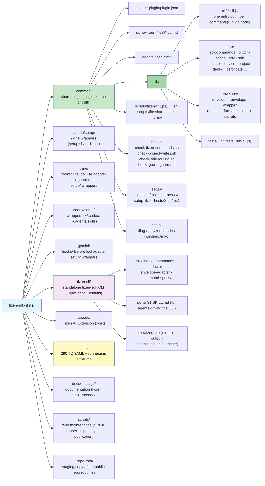
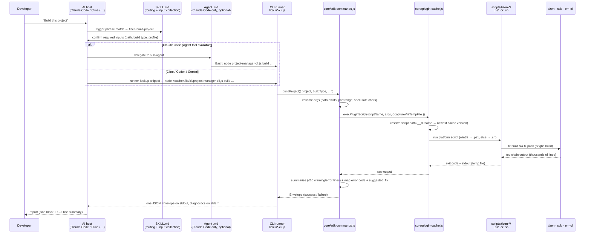
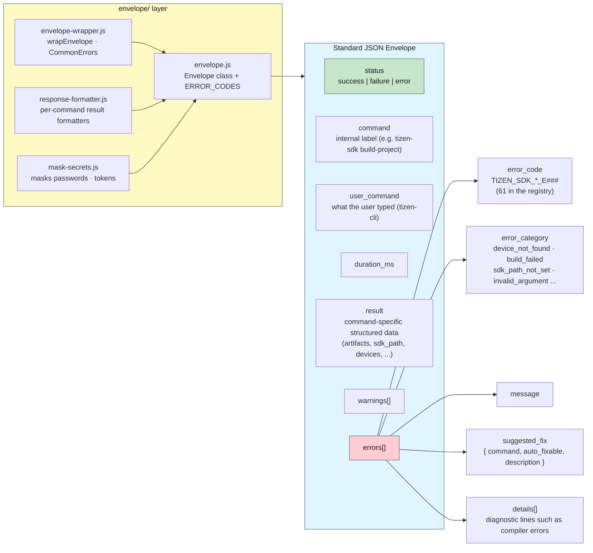
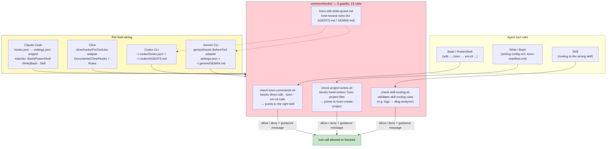
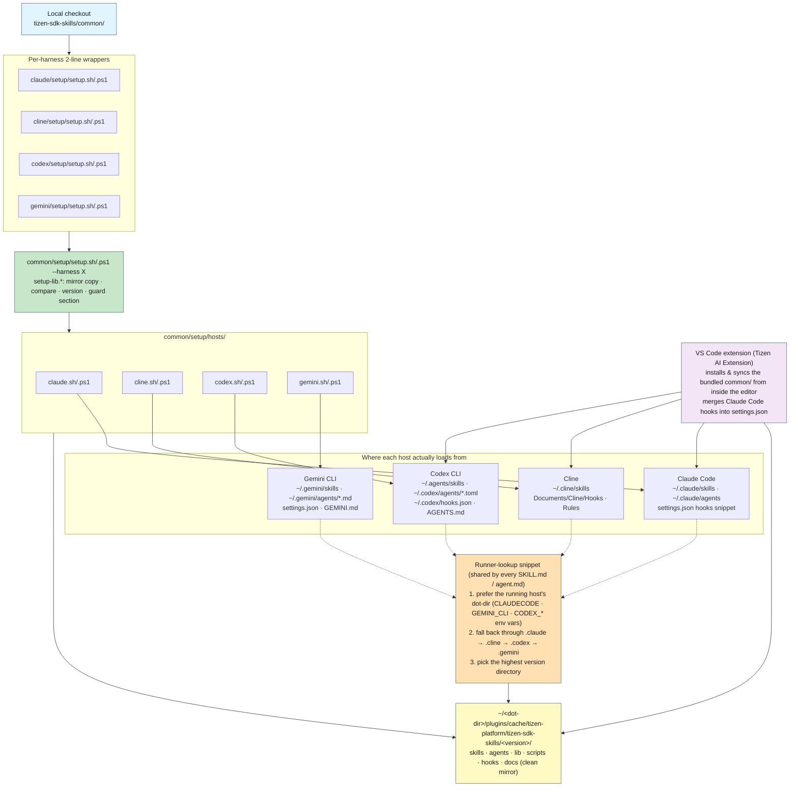
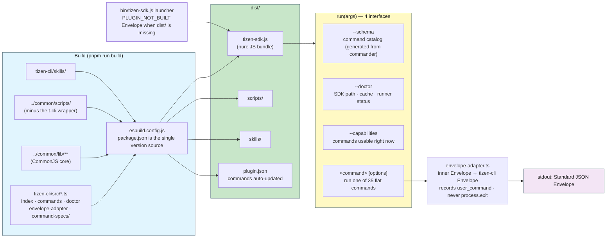
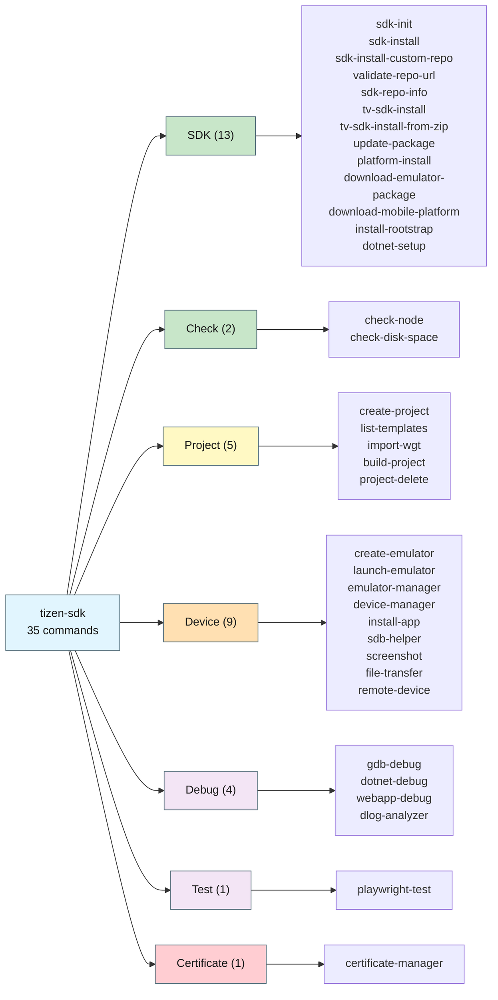
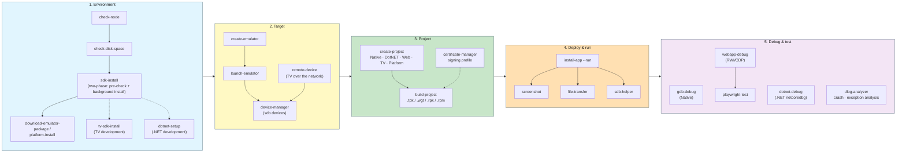
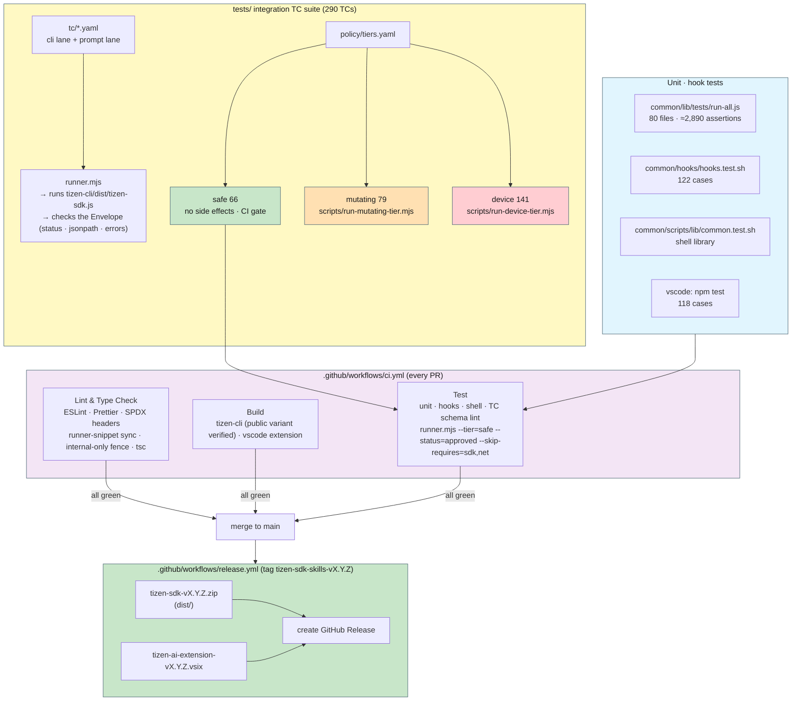

# tizen-sdk-skills Architecture Diagrams

English | [한국어](ARCHITECTURE_DIAGRAMS.md)

A set of diagrams that shows the whole `tizen-sdk-skills` repository at a glance: how the AI coding assistants (Claude Code, Cline, Codex CLI, Gemini CLI, the VS Code extension) and the standalone `tizen-sdk` CLI share **one `common/`**, which layers a natural-language request passes through before it reaches the real Tizen SDK tools (`tizen`/`tz`, `sdb`, `em-cli`, `dotnet`, `gbs`), and how the result comes back as a Standard JSON Envelope.

> The counts in the diagrams (29 skills, 24 agents, 35 commands, 61 error codes, 290 TCs) describe the public release tree and match the "Project at a Glance" table in [README.md](../README.md) (v1.4.2). Re-measure them with the commands in that table's last column.

---

## 1. Big Picture

The user asks in natural language, the host picks a skill and runs a CLI runner, the runner drives the SDK tools and returns exactly one JSON Envelope.

---

## 2. Repository Layout

`common/` holds all the logic; every other directory is either a **thin per-harness adapter** or a tool (CLI, extension, tests, docs).

---

## 3. Call Flow

The layers one request passes through. Why each intermediate layer exists is explained in [SDK_LAYERS_OVERVIEW.en.md](SDK_LAYERS_OVERVIEW.en.md); the function-level mapping is in [SDK_COMMANDS_ARCHITECTURE.en.md](SDK_COMMANDS_ARCHITECTURE.en.md).

**Key rule:** the agent never calls `.ps1`/`.sh` or `sdb` directly. It always goes through the runner and relays only the Envelope the runner returned. The guard hooks in section 5 enforce this.

---

## 4. Standard JSON Envelope

Every command prints **exactly one Envelope** on stdout. An agent can decide its next step from `status` and `errors[].suggested_fix` alone.

The dependency direction is always `cli/ → core/ → envelope/` with no reverse dependency. See [envelope/ENVELOPE_USAGE_GUIDE.en.md](envelope/ENVELOPE_USAGE_GUIDE.en.md) for details.

---

## 5. Guard Hooks

PreToolUse hooks that stop an agent from bypassing the runner to call SDK tools directly or from hand-writing project files. The hook scripts exist once in `common/hooks/`; a per-host adapter connects each host's hook protocol to those scripts.

Run the hook tests with `bash common/hooks/hooks.test.sh` (122 cases).

---

## 6. Harness Setup & Sync

Every harness mirrors **the same `common/` into the same cache path layout**. The only differences are where skills, agents and hooks are loaded from and the agent file format.

`node scripts/rewrite-runner-snippets.js --check` keeps the runner-lookup snippet identical across all skills and agents. Per-host paths are listed in [deployment/HARNESS_SETUP.en.md](deployment/HARNESS_SETUP.en.md).

---

## 7. Standalone tizen-sdk CLI (tizen-cli/)

A CLI that runs the same commands without any AI host. esbuild inlines `common/lib` into **a single JS file** and copies `common/scripts` next to it.

`command-specs/` holds declarative per-domain specs (sdk, check, project, device, debug, dlog-analyzer, test, certificate). `tests/runner.mjs` executes this same bundle.

---

## 8. Command Domains (35)

Skills are named `tizen-<command>`; the CLI form is `tizen-sdk <command>`. The exact correspondence is in [SKILLS_COMMANDS_MAPPING.en.md](SKILLS_COMMANDS_MAPPING.en.md).

---

## 9. Typical End-to-End Flow

The order in which skills chain together when a first-time user goes from SDK install to debugging in natural language. Every step can also run on its own.

Step-by-step scenarios live in [usage/usage.en.md](../usage/usage.en.md) and the walkthrough documents under `docs/`.

---

## 10. Tests & CI (Quality Gates)

Three layers of verification: unit tests (functions), hook tests (guards) and integration TCs (whole commands). CI runs only the side-effect-free `safe` tier automatically.

How to run the TC suite and the per-tier caveats are in [tests/README.md](../tests/README.md).

---

## Related Documents

- [README.md](../README.md) — project overview, quick start, the 35-command table, "Project at a Glance"
- [SDK_LAYERS_OVERVIEW.en.md](SDK_LAYERS_OVERVIEW.en.md) — why the intermediate layers (CLI runner → sdk-commands → plugin-cache → script) exist
- [SDK_COMMANDS_ARCHITECTURE.en.md](SDK_COMMANDS_ARCHITECTURE.en.md) — full call flow and runner-to-function mapping
- [SKILLS_REFERENCE.en.md](SKILLS_REFERENCE.en.md) — trigger phrases, parameters and response formats per skill
- [SKILLS_COMMANDS_MAPPING.en.md](SKILLS_COMMANDS_MAPPING.en.md) — skills ↔ commands correspondence
- [envelope/ENVELOPE_USAGE_GUIDE.en.md](envelope/ENVELOPE_USAGE_GUIDE.en.md) — Standard JSON Envelope usage guide
- [deployment/HARNESS_SETUP.en.md](deployment/HARNESS_SETUP.en.md) — per-host install paths and how to add a new harness
- [tizen-cli/build-and-install.en.md](tizen-cli/build-and-install.en.md) — building and installing the standalone CLI
- [tests/README.md](../tests/README.md) — test suite architecture
