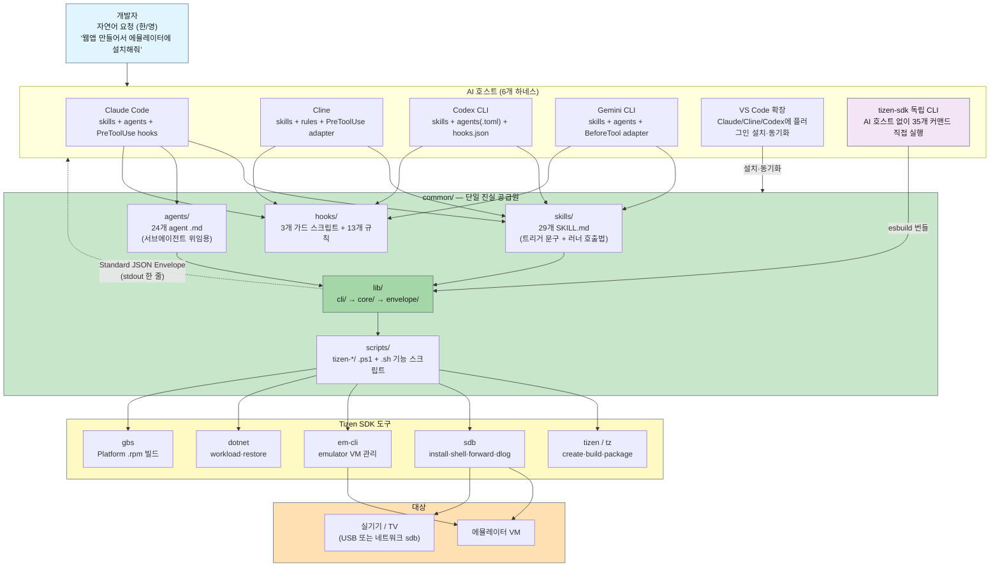
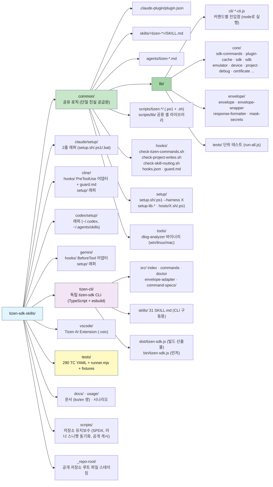
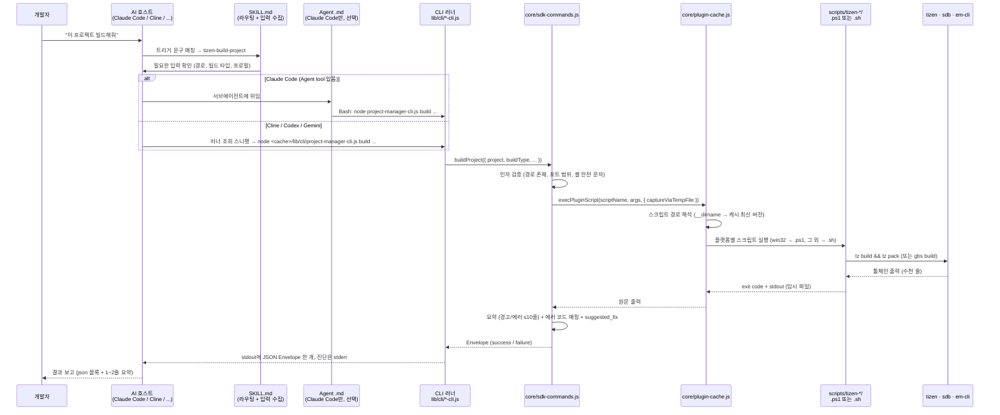
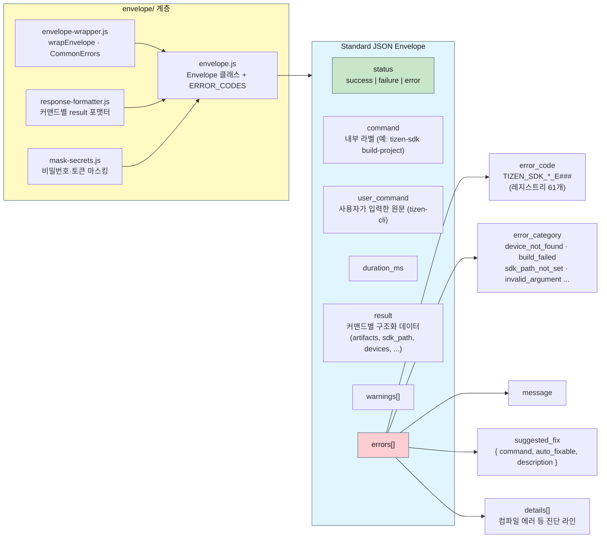
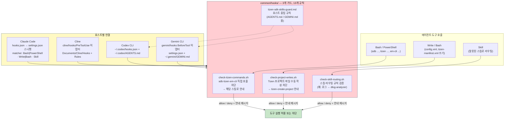
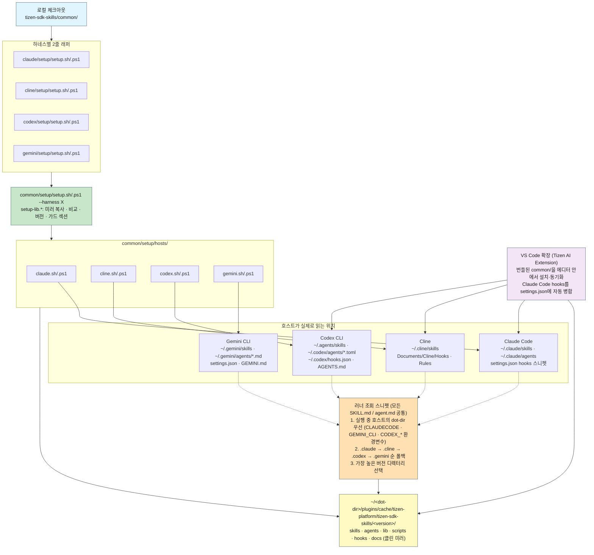
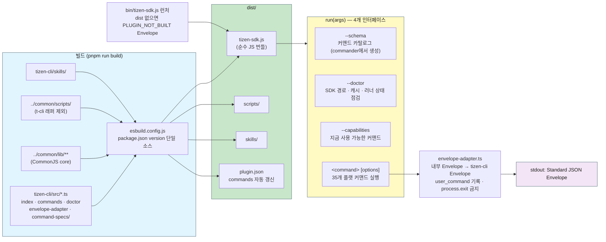
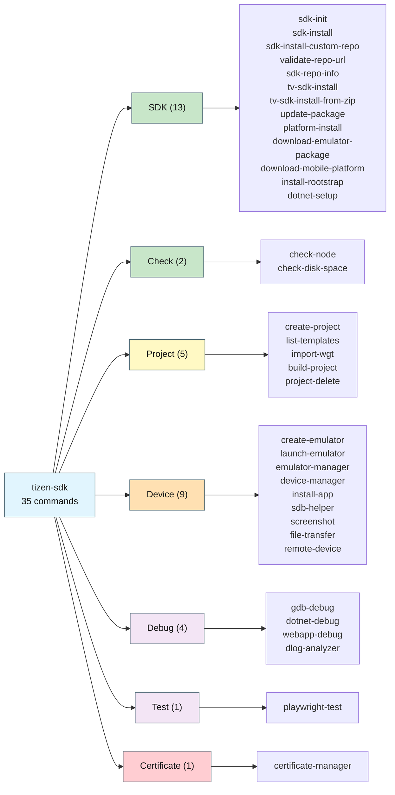
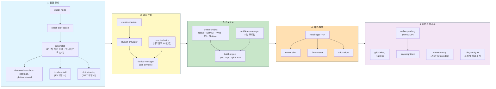
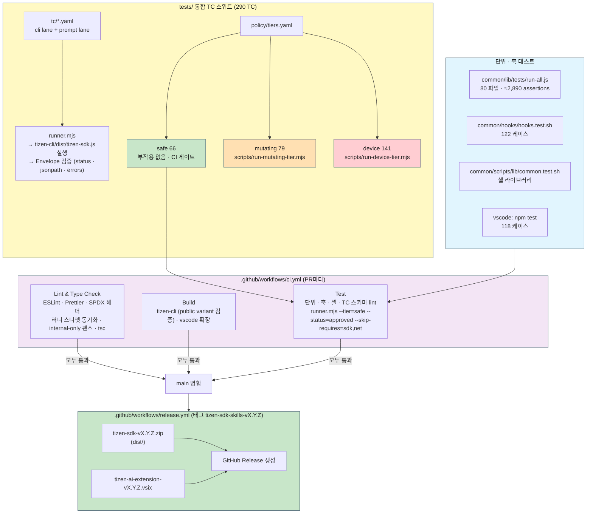

# tizen-sdk-skills 아키텍처 다이어그램

[English](ARCHITECTURE_DIAGRAMS.en.md) | 한국어

`tizen-sdk-skills` 저장소 전체를 한눈에 보여주는 다이어그램 모음입니다. AI 코딩 어시스턴트(Claude Code, Cline, Codex CLI, Gemini CLI, VS Code 확장)와 독립 실행형 `tizen-sdk` CLI가 **하나의 `common/`** 을 어떻게 공유하고, 자연어 요청이 어떤 계층을 거쳐 실제 Tizen SDK 도구(`tizen`/`tz`, `sdb`, `em-cli`, `dotnet`, `gbs`)까지 도달하는지, 그 결과가 어떻게 Standard JSON Envelope로 돌아오는지를 그림으로 설명합니다.

> 다이어그램의 개수(스킬 29, 에이전트 24, 커맨드 35, 에러 코드 61, TC 290)는 공개 배포 트리 기준이며 [README.md](../README.md)의 "Project at a Glance"(v1.4.0) 표와 같습니다. 다시 측정하려면 그 표의 마지막 열에 있는 명령을 쓰세요.

---

## 1. 전체 그림 (Big Picture)

사용자는 자연어로 요청하고, 호스트는 스킬을 골라 CLI 러너를 실행하며, 러너는 SDK 도구를 호출한 뒤 JSON Envelope 하나를 돌려줍니다.

---

## 2. 저장소 구조 (Repository Layout)

`common/`이 모든 로직을 가지고, 나머지 디렉터리는 **하네스별 얇은 어댑터**이거나 도구(CLI, 확장, 테스트, 문서)입니다.

---

## 3. 요청 처리 계층 (Call Flow)

한 번의 요청이 거치는 계층입니다. 각 중간 계층이 존재하는 이유는 [SDK_LAYERS_OVERVIEW.md](SDK_LAYERS_OVERVIEW.md)에, 함수 단위 매핑은 [SDK_COMMANDS_ARCHITECTURE.md](SDK_COMMANDS_ARCHITECTURE.md)에 있습니다.

**핵심 원칙:** 에이전트는 `.ps1`/`.sh`나 `sdb`를 직접 호출하지 않습니다. 항상 러너를 통해 실행하고, 러너가 돌려준 Envelope만 사용자에게 전달합니다. 이 규칙은 아래 5절의 가드 훅이 강제합니다.

---

## 4. Standard JSON Envelope

모든 커맨드는 stdout에 **Envelope 하나**만 출력합니다. 에이전트는 `status`와 `errors[].suggested_fix`만 보고 다음 행동을 결정할 수 있습니다.

의존 방향은 항상 `cli/ → core/ → envelope/`이며 역방향 의존은 없습니다. 자세한 내용은 [envelope/ENVELOPE_USAGE_GUIDE.md](envelope/ENVELOPE_USAGE_GUIDE.md)를 참고하세요.

---

## 5. 가드 훅 (Guard Hooks)

에이전트가 러너를 우회해 SDK 도구를 직접 실행하거나 프로젝트 파일을 손으로 쓰는 것을 막는 PreToolUse 훅입니다. 훅 스크립트는 `common/hooks/`에 하나만 있고, 호스트별 어댑터가 각 호스트의 훅 프로토콜을 이 스크립트에 연결합니다.

훅 테스트는 `bash common/hooks/hooks.test.sh`로 실행합니다(122 케이스).

---

## 6. 하네스 배포와 동기화 (Setup & Sync)

모든 하네스는 **같은 `common/`을 같은 캐시 경로 구조**로 미러링합니다. 차이는 스킬·에이전트·훅을 어디서 읽는지와 에이전트 파일 형식뿐입니다.

러너 조회 스니펫은 `node scripts/rewrite-runner-snippets.js --check`로 모든 스킬·에이전트에서 동일하게 유지됩니다. 호스트별 세부 경로는 [deployment/HARNESS_SETUP.md](deployment/HARNESS_SETUP.md)를 참고하세요.

---

## 7. 독립 실행형 tizen-sdk CLI (tizen-cli/)

AI 호스트 없이도 같은 커맨드를 실행할 수 있는 CLI입니다. `common/lib`을 esbuild로 **하나의 JS 파일**에 인라인하고, `common/scripts`를 옆에 복사합니다.

`command-specs/`는 도메인별 선언적 스펙(sdk, check, project, device, debug, dlog-analyzer, test, certificate)이며, `tests/runner.mjs`가 실행하는 대상도 이 번들입니다.

---

## 8. 커맨드 도메인 (35개)

스킬 이름은 `tizen-<command>`, CLI에서는 `tizen-sdk <command>`입니다. 정확한 대응은 [SKILLS_COMMANDS_MAPPING.md](SKILLS_COMMANDS_MAPPING.md)를 참고하세요.

---

## 9. 대표 사용 흐름 (End-to-End)

처음 사용자가 SDK 설치부터 디버깅까지 자연어로 진행할 때 스킬이 이어지는 순서입니다. 각 단계는 독립 실행도 가능합니다.

시나리오별 상세 절차는 [usage/usage.md](../usage/usage.md)와 `docs/` 아래 워크스루 문서를 참고하세요.

---

## 10. 테스트와 CI (Quality Gates)

단위 테스트(함수), 훅 테스트(가드), 통합 TC(커맨드 전체)의 세 층으로 검증하며, CI는 부작용 없는 `safe` 계층만 자동 실행합니다.

TC 스위트의 실행 방법과 계층별 주의사항은 [tests/README.md](../tests/README.md)를 참고하세요.

---

## 관련 문서

- [README.md](../README.md) — 프로젝트 개요, 빠른 시작, 35개 커맨드 표, "Project at a Glance"
- [SDK_LAYERS_OVERVIEW.md](SDK_LAYERS_OVERVIEW.md) — 중간 계층(CLI 러너 → sdk-commands → plugin-cache → 스크립트)이 존재하는 이유
- [SDK_COMMANDS_ARCHITECTURE.md](SDK_COMMANDS_ARCHITECTURE.md) — 전체 호출 흐름과 러너-함수 매핑
- [SKILLS_REFERENCE.md](SKILLS_REFERENCE.md) — 스킬별 트리거 문구·파라미터·응답 형식
- [SKILLS_COMMANDS_MAPPING.md](SKILLS_COMMANDS_MAPPING.md) — 스킬 ↔ 커맨드 대응
- [envelope/ENVELOPE_USAGE_GUIDE.md](envelope/ENVELOPE_USAGE_GUIDE.md) — Standard JSON Envelope 사용 가이드
- [deployment/HARNESS_SETUP.md](deployment/HARNESS_SETUP.md) — 하네스별 설치 경로와 새 하네스 추가 절차
- [tizen-cli/build-and-install.md](tizen-cli/build-and-install.md) — 독립 CLI 빌드·설치
- [tests/README.md](../tests/README.md) — 테스트 스위트 아키텍처
