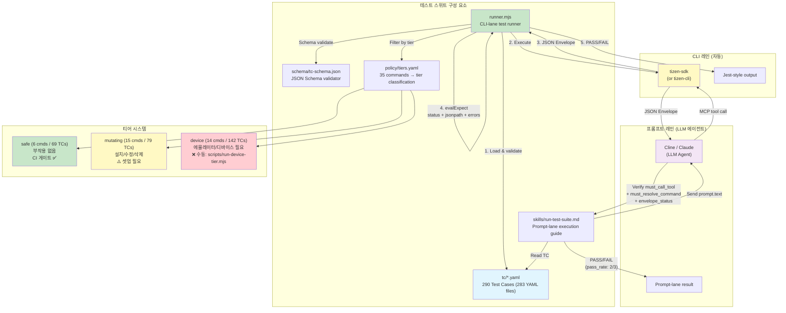
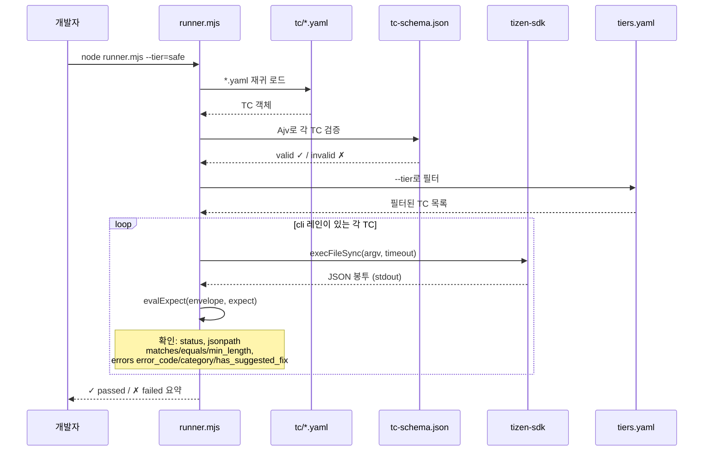
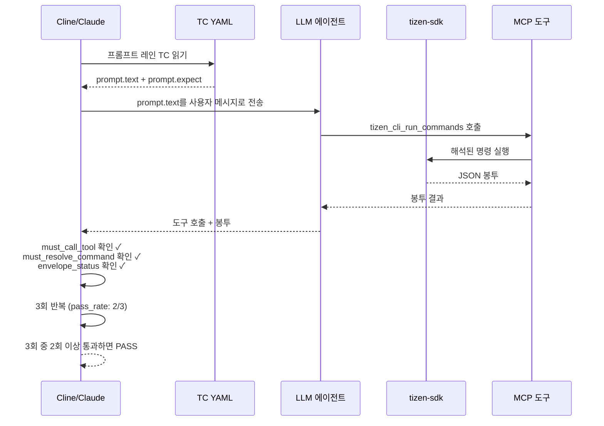
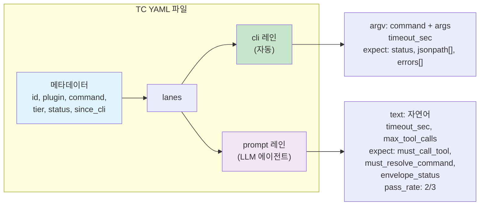

# tizen-sdk 테스트 스위트

[English](README.md) | 한국어

`tizen-sdk` 플러그인의 독립 테스트 스위트입니다. 35개 플러그인 명령 각각이 올바른 JSON 봉투(envelope)를 출력하는지, 그리고 LLM 에이전트(Cline, Claude, tizen-cli)가 자연어 프롬프트를 올바른 명령으로 해석하는지 검증합니다.

8개 도메인에 걸쳐 **290개 테스트 케이스**가 있으며, 35개 명령 중 34개와 CLI 메타 인터페이스(`--capabilities`, `--doctor`, `--schema`)를 다룹니다. `tv-sdk-install-from-zip`은 `policy/tiers.yaml`에 mutating으로 분류되어 있지만 아직 TC가 없습니다.

## 아키텍처 다이어그램



### CLI 레인 흐름 (runner.mjs)



### 프롬프트 레인 흐름 (Cline/Claude)



### TC YAML 구조



## 빠른 시작

```bash
cd tizen-cli && pnpm install && pnpm build && cd ../tests   # 러너는 tizen-cli/dist/tizen-sdk.js를 실행함 (--dry-run에는 불필요)
npm install
node runner.mjs --dry-run    # 실행 없이 TC 검증 (빌드·SDK 불필요)
node runner.mjs --tier=safe  # safe 티어만 (부작용 없음)
node runner.mjs              # 모든 TC 실행 — mutating·device 티어까지 포함되는데, bare 실행으로는
                             # 통과할 수 없고 ~/.tizen.sdk.path.config를 덮어쓰며 fixture를 소모함.
                             # 아래 "Device 티어" / "Mutating 티어"를 먼저 읽을 것
```

티어별 단계별 실행 순서는 [RUN-ORDER.ko.md](RUN-ORDER.ko.md)에 정리되어 있습니다.

`common/lib`, `common/scripts`, `tizen-cli/src` 아래를 수정한 뒤(그리고 이 경로를 건드리는 `git checkout` /
`git pull` 뒤)에는 반드시 `tizen-cli/dist/`를 다시 빌드하세요. 이를 확인하는 것은 티어 드라이버와 fixture
스크립트만입니다(`scripts/lib/driver-common.mjs`의 `checkDistFresh()`가 번들의 mtime을 위 트리와 비교해 오래되면
시작을 거부). `runner.mjs`와 런처는 `dist/tizen-sdk.js`의 존재만 확인하므로(없으면 `PLUGIN_NOT_BUILT`), 오래된
번들은 아무 경고 없이 옛 코드를 실행합니다.

## 무엇을 테스트하는가

| 레이어          | TCs | 대상                                   | 방법                                                                                         |
| --------------- | --- | -------------------------------------- | -------------------------------------------------------------------------------------------- |
| **cli 레인**    | 170 | 명령이 올바른 봉투를 출력              | `runner.mjs`가 `tizen-sdk <command>`를 실행하고 status, jsonpath, errors를 확인               |
| **prompt 레인** | 120 | LLM이 프롬프트를 올바른 명령으로 해석  | Cline/Claude가 TC를 읽고 프롬프트를 보내 도구 호출을 검증 (`skills/run-test-suite.md` 참고)  |

모든 TC는 레인을 하나만 정의하므로 두 수를 더하면 전체 290개가 됩니다.

### 기존 단위 테스트(`common/lib/tests/`)와의 비교

|          | 단위 테스트              | 이 스위트                |
| -------- | ------------------------ | ------------------------ |
| 범위     | 개별 함수                | 명령 전체                |
| 환경     | Node.js만                | tizen-cli + 플러그인     |
| LLM      | 테스트 안 함             | 프롬프트 해석 검증       |
| 목적     | 리팩터링 중 회귀 방지    | 릴리스 품질 게이트       |

## 디렉터리 구조

```
tests/
  README.md               ← 영문 README (이 파일은 README.ko.md)
  RUN-ORDER.md            ← safe / mutating / device 티어 단계별 실행 순서 (RUN-ORDER.ko.md: 한국어)
  TEST-SUITE-PLAN.md      ← 설계 문서
  CSV-YAML-MAPPING.md     ← CSV TC ID ↔ YAML 추적 표
  package.json            ← 의존성 (yaml, ajv)
  runner.mjs              ← cli 레인 테스트 러너
  schema/
    tc-schema.json        ← TC YAML JSON Schema
  policy/
    tiers.yaml            ← 35개 명령의 티어 분류
    device-run-order.yaml    ← device 티어의 단계별 실행 순서 ("Device 티어" 참고)
    mutating-run-order.yaml  ← mutating 티어의 단계별 실행 순서 ("Mutating 티어" 참고)
  fixtures/               ← mutating TC용 커밋된 상태 파일 (테스트 인증서, profiles.xml)
    fixtures.env          ← ${NAME} argv 플레이스홀더 값 (암호를 argv에서 분리)
    apps/                 ← (gitignored) fixture 앱, tmp/ + projects/ 스크래치 디렉터리,
                             fixtures.generated.env — scripts/prepare-device-fixtures.mjs가 생성
  scripts/
    verify-doc-stats.mjs  ← CI 게이트: 문서 통계가 실제 TC 파일과 일치해야 함
    runner-helpers.test.mjs      ← runner.mjs helper 단위 테스트 + order 파일 일관성 검사
    cdn-mirror-selection.test.mjs ← 인스톨러 .sh/.ps1의 시간대 → CDN 미러 매핑 일치 검사
    prepare-device-fixtures.mjs  ← fixture 앱 빌드/서명, tmp/ + projects/ 디렉터리, playwright 프로젝트
    run-device-tier.mjs          ← 순서가 정해진 자체 정리형 device 티어 실행 ("Device 티어" 참고)
    run-mutating-tier.mjs        ← 순서가 정해진 자체 정리형 mutating 티어 실행 ("Mutating 티어" 참고)
    lib/driver-common.mjs        ← 위 세 스크립트의 공용 helper (FIXTURE_NEEDS 포함)
  tc/                     ← 283개 YAML 파일에 290개 테스트 케이스
    device/               ← 103 TCs (create-emulator, launch-emulator, emulator-manager,
                                     device-manager, install-app, file-transfer,
                                     remote-device, screenshot, sdb-helper)
    sdk/                  ←  66 TCs (check-node, check-disk-space, sdk-init, sdk-install,
                                     sdk-install-custom-repo, tv-sdk-install, sdk-repo-info,
                                     validate-repo-url, update-package, platform-install,
                                     download-emulator-package, download-mobile-platform,
                                     install-rootstrap, dotnet-setup)
    debug/                ←  32 TCs (gdb-debug, dotnet-debug, webapp-debug)
    project/              ←  28 TCs (create-project, build-project, project-delete,
                                     list-templates)
    certificate/          ←  25 TCs (certificate-manager 액션)
    meta/                 ←  17 TCs (--capabilities, --doctor, --schema, list-commands,
                                     no-args, guard-rules)
    test/                 ←  15 TCs (playwright-test)
    dlog-analyzer/        ←   4 TCs (dlog-analyzer)
  skills/
    run-test-suite.md     ← Cline/Claude 프롬프트 레인 실행 가이드
```

## TC 패턴

| 패턴                      | 설명                                                                     |
| ------------------------- | ------------------------------------------------------------------------ |
| `*.happy.yaml`            | 정상 실행 → `status: success` 기대                                       |
| `*.missing-required.yaml` | 필수 옵션 누락 → `status: failure` + `invalid_argument` 기대            |
| `*.invalid-type.yaml`     | 잘못된 선택 값 → `status: failure` 기대                                  |
| `*.invalid-path.yaml`     | 존재하지 않는 경로 → `status: failure` 기대                              |
| `*.prompt-happy.yaml`     | LLM 프롬프트 해석 → 도구 호출 + 명령 검증                                |
| `*.scan-happy.yaml`       | 네트워크 스캔 → `status: success` 기대                                   |

## 러너 옵션

```
node runner.mjs                    # 모든 TC 실행
node runner.mjs --tier=safe        # safe 티어 TC만
node runner.mjs --tier=mutating    # mutating 티어 TC만
node runner.mjs --tier=device      # device 티어 TC만
node runner.mjs --dry-run          # 명령 실행 없이 TC 검증
node runner.mjs --tc=check-node    # TC id 부분 문자열로 필터
node runner.mjs --domain=sdk       # 도메인 디렉터리로 필터
node runner.mjs --status=approved  # 검증된 TC만 (회귀 게이트)
node runner.mjs --skip-requires=sdk,net
                                   # requires.capabilities가 이 호스트에 없는 것을
                                   # 요구하는 TC를 건너뜀 (아래 참고)
node runner.mjs --order=policy/<tier>-run-order.yaml [--phase=<name>]
                                   # readdir 순서 대신 파일에 나열된 TC id를 그 순서로
                                   # 실행 (중복 허용) ("Device 티어", "Mutating 티어" 참고)
node runner.mjs --help             # 사용법
```

`quarantined` TC는 `--status=quarantined`로 명시하지 않으면 제외됩니다.
알 수 없는 옵션(또는 `=` 없는 `--tier safe` 같은 오타)은 모든 TC를 조용히 실행하는 대신 exit 2로 중단합니다.

`--order` 없이는 TC가 readdir 순서로 실행됩니다: 디렉터리 순(`certificate`, `debug`, `device`, …), 파일은
알파벳 순, 엄격히 순차, 셋업/티어다운 없음. safe 티어에는 문제없지만 device 티어에는 자멸적입니다(다음 절).

### Device 티어: `scripts/run-device-tier.mjs`

`node runner.mjs --tier=device`를 bare로 실행하지 마세요. readdir 순서에서는 16개 debug TC가 에뮬레이터가
생기기 전에 실행되고, `create-emulator` TC 3개가 모두 `test-vm`을 만들며(em-cli는 중복 이름을 거부),
`emulator-manager.delete`가 `.detail`/`.modify-ram`/`.reset`과 `launch-emulator.happy`보다 먼저 정렬되고,
`device-manager.stop`이 `device-manager.timeout`보다 먼저 정렬되며, remote-device 북마크 체인이 IP를 조회하는
TC보다 먼저 IP를 수정합니다. 어떤 호스트에서도 통과할 수 없습니다.

통과하는 순서는 `policy/device-run-order.yaml`에 있고(같은 id가 여러 번 나올 수 있음, 예: create TC 사이의
`emulator-manager.delete`), `scripts/run-device-tier.mjs`가 이를 실행합니다:

```bash
cd tizen-cli && pnpm build && cd ../tests   # preflight는 common/lib, common/scripts, tizen-cli/src보다 오래된 dist/를 거부
node scripts/prepare-device-fixtures.mjs    # 호스트당 한 번: fixture 앱 빌드 (6~12분, 아래 참고)
node scripts/run-device-tier.mjs            # preflight + 계획 출력, 변경 없음
node scripts/run-device-tier.mjs --yes      # 모든 단계 실행 (~20분, 파괴적 — 아래 참고)
node scripts/run-device-tier.mjs --yes --include-drafts    # 승격 실행: order 파일에 나열된 draft TC도 실행
node scripts/run-device-tier.mjs --yes --skip-tv-boot      # tv-vm 부팅 생략; device-manager.tv는 실패
node scripts/run-device-tier.mjs --yes --phase=e-network   # 한 단계만, VM pre-clean/teardown 없음
npm run prepare:device                       # = prepare-device-fixtures.mjs
npm run test:device                          # = 계획만 출력
```

| Phase | TCs | 전제 / hook |
| --- | --- | --- |
| `a-no-device` | missing-required, list-*, handoff 봉투 | 부팅된 것 없음 |
| `b-vm-lifecycle` | `test-vm` create/detail/modify/reset/delete, `create-image` | VM 정지; hook `resetImageDir`가 `${FIXTURE_TMP_DIR}/emulator-images`를 비움 |
| `c-boot-1` | `create-emulator.launch`, device-manager, screenshot, sdb-helper | `test-vm`을 부팅하고 c2~c6까지 **켜진 채로 유지** |
| `c2-fixture-apps` | install-app ×3 (네이티브 패키지; `.run`은 앱을 실행 상태로 남김), file-transfer push/pull, `screenshot.output-path` | hook `deviceFixtures`: `sdb root on`, .NET/웹 fixture 패키지 `install-app`, `/tmp/log.txt` 기록 |
| `c3-web-debug` | webapp-debug ×4, playwright-test ×6 | hook `debugCleanup`, `resetTestProject` (scaffold는 기존 테스트 파일을 거부) |
| `c4-dotnet-debug` | dotnet-debug ×5 | hook `debugCleanup` |
| `c5a` / `c5b` / `c5c` / `c5d` | gdb-debug launch / attach / breakpoints / `--serial`, 단계당 1개 | 각 단계 전 hook `debugCleanup`: attach 모드는 stale gdbserver를 죽이기 전에 `pidof <exec>`로 PID를 구함 |
| `c6-stop` | `device-manager.stop` | hook `debugCleanup` |
| `d-boot-2` | launch-emulator happy / first-available, stop, delete | `test-vm`만 존재 |
| `e-network` | remote-device 북마크 체인, 스캔 | hook `stripBookmarksHook` |
| `f1-tv-create`, `f2-tv-detect` | `create-emulator.tv`, `device-manager.tv` | 사이에 hook `bootTvVm` |

**Fixture** (`scripts/prepare-device-fixtures.mjs`, 멱등, `--skip-build` / `--only=…` / `--clean`):
c2~c5 TC와 `create-image`는 원래 작성 시의 Linux `/tmp/...` 경로와 하드코딩된 앱 id 대신 `${FIXTURE_*}` argv
플레이스홀더를 사용합니다. 스크립트는 네이티브 BasicUI, .NET TizenNUITemplate, 웹 Basic 프로젝트를
`fixtures/apps/`(gitignored)에 생성해 Debug 빌드하고 `myProfile`로 서명합니다 — `myProfile`은 없으면
`fixtures/certs/test-fixture-author.p12`로 만들고, 이미 그 인증서를 쓰면 유지하고, 다른 인증서를 가리키면
`--replace-profile` 없이는 에러로 그대로 둡니다 —, 앱 id를 `tizen-manifest.xml` / `config.xml`에서 다시
읽고(플러그인은 id를 고정할 수 없음: 웹 id는 임의의 10자 패키지 접두어를 받음), `tmp/`(`config.xml`, `logs/`,
`shots/`, `emulator-images/`, `npm install playwright`한 `test-project/`)를 배치하고, 절대 경로 값을
`fixtures/apps/fixtures.generated.env`에 기록합니다. 드라이버는 이 파일을 러너 환경에 병합하고, 단계마다 그
단계가 필요로 하는 키가 비어 있거나 없는 파일을 가리키면 시작을 거부합니다(`scripts/lib/driver-common.mjs`의
`FIXTURE_NEEDS`; `runner-helpers.test.mjs`가 이 표를 TC가 실제 쓰는 플레이스홀더와 대조).
`fixtures/fixtures.env`는 플레이스홀더 이름의 문서용 기본값만 담습니다. `fixtures/README.md` 참고.

드라이버가 러너 주위에 더하는 것:

- **Preflight**: `tizen-cli/dist/tizen-sdk.js`가 `common/lib`, `common/scripts`, `tizen-cli/src`보다 최신
  (아니면 `cd tizen-cli && pnpm build`); `tizen-sdk --doctor`에 실패 항목 없음; SDK·데이터 경로 해석 가능;
  `check-whpx.exe` / `check-hax.exe` 출력(정보용 — 플러그인은 하이퍼바이저를 직접 확인하지 않으며, 없으면 부팅
  타임아웃으로 드러남); 온라인 에뮬레이터 없음; `fixtures.generated.env` 존재 및 산출물 존재.
- **백업 / pre-clean** (`--yes`): Device Manager 북마크 목록
  (`<sdk-data>/device-manager/config/remote_device_scan.list`)을 스크래치 디렉터리로 복사; `test-vm`과
  `tv-vm` 삭제(TC가 둘 다 생성함).
- **Hook** (위 표; 스크립트의 `PHASE_HOOKS`): 각 단계 직전에 실행되며 `--phase=<name>` 실행에서도 동작하고,
  전제를 확립했는지 보고합니다 — hook 실패는 요약에 표시되고 해당 단계의 TC가 통과해도 exit 1이 됩니다.
  `debugCleanup` = `sdb forward --remove-all` + 디바이스에서
  `pkill -f netcoredbg; pkill gdbserver; pkill <native exec>; app_launcher -t <fixture ids>` —
  모든 debug TC는 호스트 포트(9222/9223, 4711, 5039)를 포워드하고 앱을 디버거 아래에 남깁니다.
- **Teardown** (항상: 단계 실패, 예외, Ctrl+C 뒤에도, 이전 단계가 실패해도 각 단계 시도):
  `device-manager --action stop`, `test-vm` 삭제(`--keep-test-vm` 제외), `tv-vm` 유지, 마지막에 북마크 목록
  복원. `--phase=<name>`이면 VM pre-clean과 VM teardown은 건너뜁니다(그 단계의 hook은 실행되고 북마크 목록은
  복원됨); `--phase=c-boot-1` 단독 실행은 `test-vm`을 켜진 채로 남깁니다.
- 스크래치 cwd에서 러너를 실행하고(`screenshot.*`가 `./emulator_screenshot.png`를 씀) 모든 출력을
  `<scratch>/run.log`로 tee합니다.

`--yes`에서 파괴적인 동작: `test-vm`과 `tv-vm` VM 삭제·재생성, `test-vm` 초기화, 실행 중인 **모든** 에뮬레이터
종료, 로컬 /24 대역 TCP 26101 스캔 3회(`remote-device scan`), 북마크 목록 재작성(이후 복원), `test-vm`에
fixture 앱 설치·실행·종료. `sdb-helper "reboot the device"`는 확인 게이트가 있는 intent라 명령 미리보기만 합니다.

순서가 의존하는 불변 조건: 디바이스 종속 TC가 돌 때 에뮬레이터는 최대 한 대만 온라인(`resolveSerial`은 두 대면
`multiple_devices` 반환; `screenshot.serial`은 `emulator-26101`을 단언), `f1` 전에 `tv-vm`이 존재하지 않아야
함(`launch-emulator.first-available`은 em-cli가 먼저 나열하는 것을 부팅), `reset`/`delete`/`modify`/`create-image`는
VM 정지 필요, `playwright-test.no-setup`은 `.run` 직후여야 함(9222의 CDP 포워드를 재사용). order 파일 수정은
`node runner.mjs --dry-run --tier=device --order=policy/device-run-order.yaml`로 검증하세요 — 오타나 모호한 id는
exit 2로 중단되며(`--status=approved`를 더하면 draft도 거부), `scripts/runner-helpers.test.mjs`가 approved
device TC가 모두 나열되어 있는지 확인합니다.

두 개의 `draft` device TC는 의도적으로 실행에서 제외됩니다: `remote-device.connect` / `.connect-custom-port`는
네트워크로 접근 가능한 Tizen 디바이스가 필요합니다(`127.0.0.1`은 에뮬레이터의 sdb 행을 중복시켜 `resolveSerial`을
깨뜨림); `requires.capabilities: [net-device]`를 선언합니다. `file-transfer.prompt-pull-missing`은 cli 레인이
없고 `test-vm`을 부팅한 상태에서 에이전트 세션이 실행합니다(`skills/run-test-suite.md` 참고).

### Mutating 티어: `scripts/run-mutating-tier.mjs`

`node runner.mjs --tier=mutating` bare 실행도 통과할 수 없습니다: `build-project.*`가 빌드 대상 프로젝트를 만드는
`create-project` TC보다 먼저 정렬되고, `project-delete.happy`가 이후 빌드보다 먼저 정렬되며,
`certificate-manager.remove-profile`은 fixture `profiles.xml`을 소모하고, `generate-author` /
`import-certificate`는 이전 실행이 `<sdk-data>/keystore/`에 남긴 것을 덮어쓰기를 거부합니다.
`policy/mutating-run-order.yaml`은 프로비저닝된 호스트가 아무것도 설치하지 않고 실행할 수 있는 TC 순서를
정하고, `scripts/run-mutating-tier.mjs`가 이를 실행합니다:

```bash
cd tizen-cli && pnpm build && cd ../tests   # preflight는 common/lib, common/scripts, tizen-cli/src보다 오래된 dist/를 거부
node scripts/prepare-device-fixtures.mjs --only=tmp,projects,rootstrap   # 스크래치 디렉터리, rootstrap ZIP, 서명 프로필 myProfile, fixtures.generated.env
node scripts/run-mutating-tier.mjs            # preflight + 계획, 변경 없음
node scripts/run-mutating-tier.mjs --yes      # ~5분; 아래 "파괴적" 참고
node scripts/run-mutating-tier.mjs --yes --include-drafts     # 승격 실행
node scripts/run-mutating-tier.mjs --yes --phase=k3-cert-profiles
node scripts/run-mutating-tier.mjs --yes --with-installers    # + s2/s3 단계: 임시 home에 실제 SDK 설치
                                                              #   (60~90분, ~10GB) — 아래 참고
node scripts/run-mutating-tier.mjs --yes --with-installers --keep-scratch-sdk   # triage용으로 <scratch>/home 보존
npm run prepare:mutating / npm run test:mutating
```

| Phase | TCs | 전제 / hook |
| --- | --- | --- |
| `s1-sdk-idempotent` | `sdk-install.happy/.specific-version/.custom-repo`, `sdk-install-custom-repo.happy/.specific-version`, `tv-sdk-install.happy`, `dotnet-setup.happy/.specific-version` | 설치된 SDK: 모든 명령이 이미 설치됨 short-circuit을 탐(다운로드 없음); `--repo-url` TC는 먼저 네트워크로 `${TC_CUSTOM_REPO_URL}`을 검증 |
| `k1-cert-readonly` | `list-profiles`, `list-distributors`, `inspect-certificate` | — |
| `k2-cert-keystore` | `generate-author` ×3, `import-certificate` ×2 | hook `cleanKeystore`: `<sdk-data>/keystore` 아래 `author/{TestDev,Jane-Dev,TestDev-v2,test-fixture-author}.*`와 `distributor/test-fixture-author.*`만 제거 |
| `k3-cert-profiles` | `create-profile`, `set-active-profile`, `remove-profile` | hook `resetProfileFixtures`: 실행 시 백업에서 `fixtures/profiles/*.xml` 복원, `create-profile`이 쓰는 스크래치 `${FIXTURE_TMP_DIR}/profiles/created-profiles.xml` 삭제 (SDK의 실제 `profiles.xml`은 절대 건드리지 않음) |
| `p1-projects` | `create-project.native-happy/.webapp-happy/.dotnet-happy/.force` (`.force` 2회 — 두 번째가 실제 덮어쓰기), `build-project.compiler-flags` (파서가 `--cflags`를 거부 → `invalid_argument`), `build-project.happy/.clean/.release`, `project-delete.happy` | hook `resetProjectsDir`가 `${FIXTURE_PROJECTS_DIR}`를 비움; 빌드는 첫 TC가 만든 `MyNativeApp`을 대상으로 prepare 스크립트가 만든 `myProfile`로 서명 |
| `s2-sdk-installers` (**opt-in**) | `sdk-install-custom-repo.force`, `tv-sdk-install.force`, `platform-install.happy`, `download-emulator-package.specific-version/.happy/.force`, `download-mobile-platform.happy/.iot-headed`, `update-package.dry-run/.happy/.force`, `install-rootstrap.happy`, `sdk-install.force` | `--with-installers`; 러너 env에 `USERPROFILE`/`HOME` = `<scratch>/home` (+ 그 아래 `APPDATA`/`LOCALAPPDATA`), `TIZEN_SDK_PATH` 없음, `TIZEN_SDK_INLINE_INSTALLER=1`, `TIZEN_TOOL_TIMEOUT=3600000`; 드라이버가 먼저 User `Path` / `TIZEN_SDK_PATH`를 스냅샷 |
| `s3-dotnet-workload` (**opt-in**) | `dotnet-setup.force` | `--with-installers`; home 리디렉션 없음 (워크로드는 실제 dotnet 설치에 존재) |

드라이버는 **cwd = `tests/`**로 러너를 실행하고(인증서 TC가 `fixtures/...` 상대 경로를 사용), device 드라이버처럼
단계마다 `fixtures.generated.env`를 확인하며, `fixtures/profiles`에 커밋되지 않은 변경이 있으면 시작을
거부하고(teardown이 백업을 그 위에 복원하므로), 항상 teardown합니다: 프로필 fixture 복원, 스크래치
`profiles.xml` 삭제, `cleanKeystore` 재실행, 그리고 fixture가 깨끗한지 `git status` 자체 점검. teardown 중 두
번째 Ctrl+C는 무시되고(복원 중간에 프로세스를 죽이게 되므로), 실패한 teardown 단계는 요약에 표시되어 실행을
실패시킵니다. hook이 비우는 모든 디렉터리(여기서는 `${FIXTURE_PROJECTS_DIR}`, device 드라이버에서는
`emulator-images/`와 `test-project/`)는 `scripts/lib/driver-common.mjs`의 `guardedScratchDir()`를 거칩니다:
실제 경로가 `tests/fixtures/apps` 안에 엄격히 있어야 하고, 심볼릭 링크/junction이 아니어야 하며, 다른 드라이브에
있을 수 없습니다 — 값이 사용자가 편집할 수 있는 env 파일에서 오기 때문입니다. `--yes`에서 파괴적인 것: 정확히
그 keystore 파일과 fixture 재작성, 그리고 `sdk-install` / `tv-sdk-install` short-circuit이 건드리는 것
(`sdk.info`, `~/.tizen.sdk.path.config`). `--with-installers` 없이는 SDK 패키지를 설치하거나 제거하지 않습니다.

**Installer 단계** (`s2-sdk-installers`, `s3-dotnet-workload`; `--with-installers`나 `--phase=`로 지정하지
않으면 건너뜀). `sdk-install`, `tv-sdk-install`, `update-package`, `platform-install`,
`download-emulator-package`, `download-mobile-platform`, `install-rootstrap`의 installer 분기는 보통 pkg로
컴파일된 tizen-cli 안에서만 실행됩니다 — `node tizen-sdk.js`(러너가 플러그인을 실행하는 방식)에서는 명령이
installer를 `suggested_fix`로 반환해 에이전트가 분리 실행하도록 합니다. `TIZEN_SDK_INLINE_INSTALLER=1`
(`common/lib/core/sdk.js`의 `runsInstallerInline()`)은 그 분기를 인라인으로 실행하게 하며, 드라이버는 두 단계
모두에 이를 설정합니다. s2에서는 `USERPROFILE`/`HOME`을 `<scratch>/home`으로 돌리고 env에서 `TIZEN_SDK_PATH`를
제거하므로, `sdk-install-custom-repo.force`가 `<scratch>/home/tizen-sdk` 아래에 완전한 SDK를 만들고(그래서 첫
번째로 실행됨: 빈 home에서 `--force`는 실제 설치와 같음), 플랫폼/에뮬레이터/모바일 installer가 그 위에 추가하며
`.*-installed` 마커를 쓰고, `update-package`와 `install-rootstrap`(`prepare-device-fixtures.mjs
--only=rootstrap`의 fixture `${FIXTURE_ROOTSTRAP_ZIP}`)이 그것을 대상으로 실행되고, `sdk-install.force`가 마지막이라
기존 SDK 위의 실제 `--force`가 됩니다. 호스트의 SDK는 열지 않습니다. 스크래치 home 밖으로 새는 두 가지는 드라이버가
처리합니다: `tizen-sdk-install.ps1`이 **User** `Path`와 `TIZEN_SDK_PATH`를 스크래치 SDK로 씁니다 — 드라이버는
실행 전 둘을 `<scratch>/user-env.json`에 스냅샷하고 teardown **첫** 단계로 복원하며(러너보다 오래 살아남아 다시
덮어쓸 installer PowerShell을 먼저 종료한 뒤), 둘 중 하나가 없는 스냅샷은 거부하고(`$null`은 변수를 삭제함),
값을 다시 읽어 복원을 증명합니다; 프로세스가 강제 종료되면 `node scripts/run-mutating-tier.mjs
--restore-user-env=<scratch>/user-env.json`이 그 단계만 다시 수행합니다 — 그리고 Windows의 `LongPathsEnabled`가
이미 `1`이어야 하며, 아니면 installer가 UAC 프롬프트를 열어 headless 실행이 멈춥니다(preflight가 시작을
거부). preflight는 스크래치 드라이브에 15GB 이상 여유 공간을 요구하고 `${TC_CUSTOM_REPO_URL}/pkg_list_<os>`를
확인합니다(경고만 — 프록시 전용 네트워크에서는 node 확인은 실패하지만 PowerShell은 다운로드함). Ctrl+C는 node만이
아니라 러너의 전체 프로세스 트리를 종료합니다. teardown은 `--keep-scratch-sdk`가 아니면 `<scratch>/home`을
삭제합니다 — 정확히 `<scratch>/home`으로 해석되고, 심볼릭 링크가 아니고, 드라이버가 생성 시 쓴
`.tizen-mutating-scratch-home` 마커가 있을 때만(`scripts/lib/driver-common.mjs`의 `scratchHomeRemovable()`,
`runner-helpers.test.mjs`가 커버). s3는 호스트의 실제 .NET Tizen 워크로드를 재설치합니다(리디렉션 없음;
리디렉션된 home은 NuGet만 스크래치 디렉터리로 보냄). 60~90분과 ~10GB를 예산으로 잡으세요.

`draft`로 남아 있는 mutating cli 레인 TC(`NOTE`에 이유가 있고 `requires` 선언 있음): Samsung 온라인 CA 액션
(`samsung-login`, `generate-samsung-author/-distributor` — `[sdk, samsung-account]`)과 GBS 빌드
(`build-project.arch` / `.gbs` — `[sdk, gbs]`). 둘 다 여기서는 실행할 수 없습니다:

- *Samsung 온라인 CA* — `samsung-login`은 실제 OAuth 브라우저 로그인을 열고(또는 캐시된 토큰을 재사용),
  두 `generate-samsung-*` 액션은 그 계정으로 실제 인증서를 발급합니다. 운영자 승인을 받아 수동으로 실행하세요:
  `certificate-manager --action samsung-login --profile-name myProfile`을 한 번(대화형), 그 다음 두 TC의 argv를
  그대로(`node runner.mjs --tc=generate-samsung --include-drafts`로는 충분하지 않음 — 러너에는 브라우저가 없음),
  봉투를 TC NOTE에 기록하고 승격합니다.
- *GBS 빌드* — `gbs`, `~/GBS-ROOT`, `platform` 타입 프로젝트(`create-project --type platform --template
  dali-demo --parent-path /tmp/tizen-apps --name MyPlatformApp01`)가 있는 Linux 호스트가 필요합니다;
  `tizen-build-project.ps1`에는 GBS 경로가 없습니다. 거기서 `node runner.mjs --tc=build-project.arch
  --status=draft` / `--tc=build-project.gbs`를 실행하고 승격하세요.

### CI 게이트

`.github/workflows/ci.yml`은 모든 PR에서 safe 티어를 실행합니다:

```bash
HOME=<throwaway dir> node runner.mjs --tier=safe --status=approved --skip-requires=sdk,net
```

CI 러너에는 Tizen SDK가 없고 `download.tizen.org`로의 경로가 보장되지 않으므로, 둘 중 하나가 필요한 TC는 이를
선언하고 실패 대신 `⊘ … (requires sdk — skip)`로 보고됩니다:

```yaml
requires:
  capabilities: [sdk] # or [net]
```

| Capability | 의미                                                                     | 선언하는 TC                                                                                            |
| ---------- | ------------------------------------------------------------------------ | ------------------------------------------------------------------------------------------------------ |
| `sdk`      | 설치된 Tizen SDK (템플릿, `sdk.info`, keystore, 기본 경로)                | `list-templates.*`, `sdk-init.happy`, `sdk-install.unavailable-version`, `certificate-manager.*.happy` |
| `net`      | `download.tizen.org`로의 아웃바운드 접근                                  | `validate-repo-url.happy`, `--repo-url` 및 SDK installer TC                                            |
| `net-device` | LAN으로 접근 가능한 Tizen 디바이스 (`sdb connect`)                      | `remote-device.connect`, `.connect-custom-port`                                                        |
| `samsung-account` | 온라인 CA용 로그인된 Samsung 계정                                  | `certificate-manager.samsung-login`, `.generate-samsung-author`, `.generate-samsung-distributor`       |
| `gbs`      | GBS 툴체인과 `~/GBS-ROOT`가 있는 Linux 호스트 (platform 빌드)             | `build-project.arch`, `build-project.gbs`                                                              |

`--skip-requires`는 호스트에 대한 선언이며 탐지가 아닙니다 — 러너는 SDK가 실제로 없는지 확인하지 않습니다.
대신 CI 스텝이 확인합니다: `~/.tizen.sdk.path.config`, `~/tizen-sdk`(임시 `HOME` 아래) 또는 PATH의 `sdb`가
있으면 아무것도 실행하기 전에 실패하므로, 실행 가능한 호스트에서 `sdk` TC가 건너뛰어지는 일이 없습니다. 같은
이유로 요약 줄은 건너뛴 이유를 분류합니다(`requires sdk: 6, requires net: 1, no cli lane: 13`). safe TC를
`approved`로 승격하기 전에 위 게이트 명령을 빈 `HOME`으로 로컬에서 실행하고(리디렉션은
`sdk-init.explicit-path`가 실제 `~/.tizen.sdk.path.config`를 덮어쓰는 것도 막아줌), SDK 없이 통과하게 만들거나
`requires` 블록을 추가하세요.

**Windows:** Node의 `os.homedir()`는 `HOME`이 아닌 `USERPROFILE`을 읽으므로 그것을 리디렉션하세요 —
`USERPROFILE=<throwaway dir> node runner.mjs --tier=safe …` (PowerShell: `$env:USERPROFILE = …`). 러너는 먼저 `<throwaway dir>AppDataLocal`을 만듭니다. 이 폴더가 없으면 PowerShell 5.1이 `ModuleAnalysisCache`를 `tests/Microsoft/`(gitignore 처리됨)에 남깁니다.
`HOME`만 설정하면 `sdk-init.explicit-path`가 실제 `~/.tizen.sdk.path.config`에 `/tmp`를 쓰고, 이후 모든 sdb
기반 명령이 `\tmp\tools\sdb.exe` 경로로 실패합니다; `tizen-sdk sdk-init --sdk-path <your SDK dir>`로 복구하세요.

## 상태(Status) 분류

`tier`는 TC 실행에 무엇이 필요한지, `status`는 얼마나 검증되었는지를 말합니다.

| Status        | 개수  | 의미                                                                  |
| ------------- | ----- | --------------------------------------------------------------------- |
| `draft`       | 8     | 작성됨, 실행된 적 없음 — 단언 미검증                                  |
| `candidate`   | 0     | 실행되어 통과했지만 모든 레인이 검증되지는 않음                       |
| `approved`    | 282   | 모든 레인이 실행되어 통과; 회귀는 릴리스 블로커                       |
| `quarantined` | 0     | 불안정하거나 환경 문제로 깨진 것으로 알려짐; 기본 제외                |

스키마 검증(`--dry-run`)은 승격의 근거가 될 수 없습니다 — YAML 형태만 확인합니다.

남은 8개 draft 중 7개는 CI나 개발자 호스트가 제공하지 않는 것을 필요로 합니다: 온라인 CA용 Samsung 계정
(`certificate-manager.samsung-login`, `.generate-samsung-author`, `.generate-samsung-distributor`), Linux GBS
툴체인(`build-project.arch`, `.gbs`) 또는 LAN의 Tizen 디바이스(`remote-device.connect`,
`.connect-custom-port`). 수동 실행 방법은 "Mutating 티어"와 "Device 티어"를 참고하세요. 나머지 1개
`dlog-analyzer.prompt-symptom-routing`(TC-P-119, 이슈 #211)은 prompt 전용으로, 스킬 이름 없는 증상 보고
("에뮬레이터 CPU 300%, 동영상 재생 안 됨 — 조사해줘")가 `device-manager`가 아닌 `dlog-analyzer`로 해석되는지
확인합니다 — 판정 기준은 산문이 아니라 `expect`의 `first_resolved_command`와
`must_not_resolve_commands: ["tizen-sdk device-manager"]`로 고정되어 있으며, 에이전트 세션 3회 실행 후
승격합니다(`skills/run-test-suite.md` Option 2, `pass_rate: 3/3`).

## 티어 분류

| 티어      | 명령 수  | TCs     | 설명                        | CI 안전?      |
| --------- | -------- | ------- | --------------------------- | ------------- |
| safe      | 6        | 69      | 부작용 없음                 | ✅ 예         |
| mutating  | 15       | 79      | 설치/수정/삭제              | ⚠️ 셋업 필요  |
| device    | 14       | 142     | 에뮬레이터/디바이스 필요    | ❌ 수동       |
| **합계**  | **35**   | **290** |                             |               |

전체 분류는 `policy/tiers.yaml`을 참고하세요. CI는 모든 PR에서 `approved` safe TC를 실행하고("러너 옵션"의
"CI 게이트" 참고), device 티어는 `scripts/run-device-tier.mjs`로 수동 실행하며("러너 옵션"의 "Device 티어"
참고), mutating 티어는 `--tier=mutating`과 `fixtures/`의 fixture로 수동 실행합니다.

## 새 TC 추가

1. 적절한 `tc/<domain>/` 디렉터리에 YAML 파일 생성
2. `schema/tc-schema.json`의 스키마를 따름
3. 명명 규칙 사용: `<command>.<variant>.yaml`
4. `node runner.mjs --dry-run`으로 검증; `safe` TC는 빈 `HOME`(Windows는 `USERPROFILE`)으로 CI 게이트 명령도
   실행하고(위 "CI 게이트" 참고), 설치된 SDK나 아웃바운드 네트워크 없이 통과할 수 없으면
   `requires.capabilities: [sdk]` 또는 `[net]` 추가
5. 이 README, `README.md`, `CSV-YAML-MAPPING.md`의 개수 갱신 — CI가 `scripts/verify-doc-stats.mjs`를 실행하며,
   문서 통계(도입 문장, 아키텍처 다이어그램, 레인 표, 디렉터리 구조, 티어·상태 표)가 실제 TC 파일이나
   `policy/tiers.yaml`과 어긋나면 실패함
6. 암호나 자격 증명 형태의 값을 `argv`에 직접 쓰지 말 것(보안 스캐너가 표시함) — `${NAME}` 플레이스홀더를 쓰고
   값은 `fixtures/fixtures.env`에 base64 인코딩된 `NAME_B64=` 항목으로 정의(러너가 디코딩해 `${NAME}`으로 노출);
   러너는 실행 시점에 fixtures.env → 프로세스 env → TC의 `env:` 블록 순으로 플레이스홀더를 확장함. 키 이름
   자체에도 `PASSWORD` 같은 부분 문자열은 피할 것

예시:

```yaml
id: tizen-sdk.check-node.happy
plugin: tizen-sdk
command: check-node
tier: safe
status: draft
since_cli: 1.0.0

lanes:
  cli:
    argv: ["tizen-sdk", "check-node"]
    timeout_sec: 30
    expect:
      status: success
      jsonpath:
        - { path: "$.result.node_version", matches: "^v\\d+" }
```

## Cline/Claude에서 프롬프트 레인 TC 실행

Cline이나 Claude 에이전트가 TC YAML을 읽고 사용자 프롬프트를 시뮬레이션해 프롬프트 레인 TC를 실행하는 방법은
`skills/run-test-suite.md`를 참고하세요.

## 사전 요구 사항

- Node.js >= 20
- 빌드된 플러그인 번들: `cd tizen-cli && pnpm install && pnpm build` → `tizen-cli/dist/tizen-sdk.js`
  (gitignored; 아래 모든 cli 레인 실행기가 이를 로드)
- cli 레인 실행(`runner.mjs`의 `resolveExecutor()`):
  - Windows: PATH를 참조하지 않습니다. `TC_LAUNCHER_JS`가 설정되어 있으면 그 런처를, 아니면 소스 체크아웃의
    `../tizen-cli/bin/tizen-sdk.js`를 실행합니다(둘 다 없으면 `RUNNER_NO_EXECUTOR`). 런처는 자기 옆의
    `../dist/tizen-sdk.js`를 로드하고 없으면 `PLUGIN_NOT_BUILT` 봉투를 출력하므로, 새 체크아웃에서는 위 빌드를
    하기 전까지 모든 cli 레인 TC가 그 에러로 실패합니다.
  - Linux/macOS: `TC_LAUNCHER_JS`는 사용하지 않습니다. 러너는 PATH의 `tizen-cli`(`tizen-sdk` 플러그인 설치됨)를
    쓰고, 없으면 PATH의 독립 `tizen-sdk` 런처로 폴백합니다(`cd tizen-cli && pnpm build && pnpm add -g .`;
    pnpm 10은 `pnpm link --global`을, pnpm 11은 bare `pnpm link`를 제거함); 둘 다 없으면
    `RUNNER_NO_EXECUTOR`. CI는 설치 대신 `tizen-cli/bin/tizen-sdk.js`를 PATH에 심볼릭 링크합니다
    (`.github/workflows/ci.yml` 참고).
- `--dry-run` 모드: 빌드나 런타임 불필요, Node.js + npm 의존성만 필요
