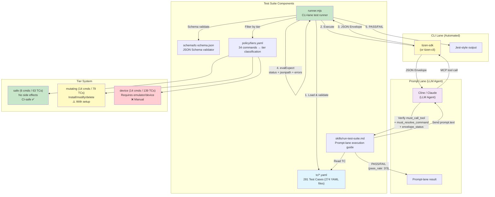
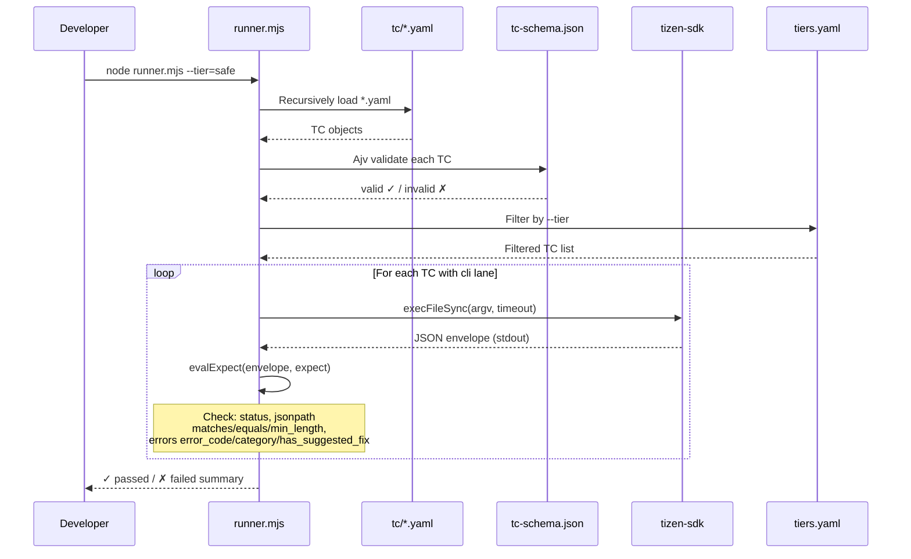
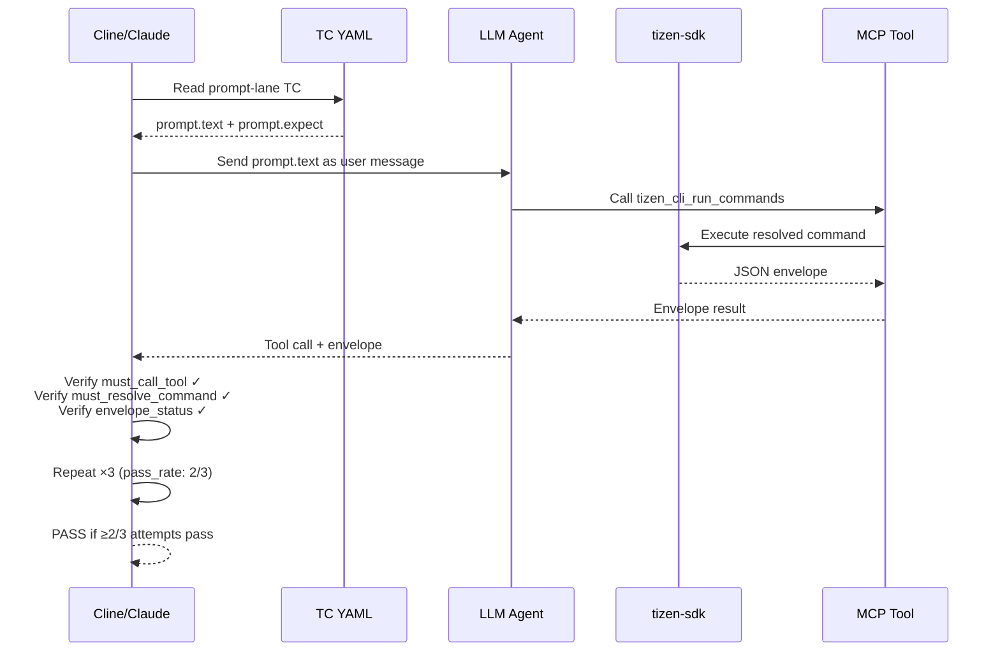
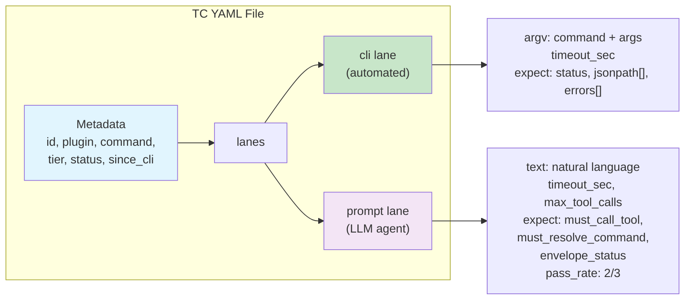

# tizen-sdk Test Suite

Self-contained test suite for the `tizen-sdk` plugin. Verifies that each of the 34 plugin commands produces the correct JSON envelope output and that LLM agents (Cline, Claude, tizen-cli) resolve natural-language prompts to the correct commands.

**281 test cases** across 8 domains, covering 33 of the 34 commands plus CLI meta-interfaces (`--capabilities`, `--doctor`, `--schema`). `tv-sdk-install-from-zip` is classified in `policy/tiers.yaml` (mutating) but has no TCs yet.


## Architecture Diagram



### CLI Lane Flow (runner.mjs)



### Prompt Lane Flow (Cline/Claude)



### TC YAML Structure



## Quick Start

```bash
cd tests
npm install
node runner.mjs              # run all TCs
node runner.mjs --tier=safe  # only safe-tier (no side effects)
node runner.mjs --dry-run    # validate TCs without executing
```

## What This Tests

| Layer           | TCs | What                                   | How                                                                                      |
| --------------- | --- | -------------------------------------- | ---------------------------------------------------------------------------------------- |
| **cli lane**    | 171 | Command produces correct envelope      | `runner.mjs` executes `tizen-sdk <command>` and checks status, jsonpath, errors   |
| **prompt lane** | 118 | LLM resolves prompt to correct command | Cline/Claude reads TC, sends prompt, verifies tool call (see `skills/run-test-suite.md`) |

8 TCs define both lanes, so the lane counts sum to more than 281.

### vs. Existing Unit Tests (`common/lib/tests/`)

|             | Unit Tests                 | This Suite                 |
| ----------- | -------------------------- | -------------------------- |
| Scope       | Individual functions       | Complete commands          |
| Environment | Node.js only               | tizen-cli + plugin         |
| LLM         | Not tested                 | Prompt resolution verified |
| Purpose     | Regression during refactor | Release quality gate       |

## Directory Structure

```
tests/
  README.md               ← this file
  TEST-SUITE-PLAN.md      ← design document
  CSV-YAML-MAPPING.md     ← CSV TC ID ↔ YAML traceability table
  package.json            ← dependencies (yaml, ajv)
  runner.mjs              ← cli-lane test runner
  schema/
    tc-schema.json        ← TC YAML JSON Schema
  policy/
    tiers.yaml            ← 34 commands classified by tier
  fixtures/               ← committed state files (test cert, profiles.xml) for mutating TCs
    fixtures.env          ← values for ${NAME} argv placeholders (keeps passwords off argv)
  scripts/
    verify-doc-stats.mjs  ← CI gate: doc statistics must match actual TC files
  tc/                     ← 283 test cases in 276 YAML files
    device/               ← 103 TCs (create-emulator, launch-emulator, emulator-manager,
                                     device-manager, install-app, file-transfer,
                                     remote-device, screenshot, sdb-helper)
    sdk/                  ←  64 TCs (check-node, check-disk-space, sdk-init, sdk-install,
                                     sdk-install-custom-repo, tv-sdk-install, sdk-repo-info,
                                     validate-repo-url, update-package, platform-install,
                                     download-emulator-package, download-mobile-platform,
                                     install-rootstrap, dotnet-setup)
    debug/                ←  32 TCs (gdb-debug, dotnet-debug, webapp-debug)
    project/              ←  26 TCs (create-project, build-project, project-delete,
                                     list-templates)
    certificate/          ←  25 TCs (certificate-manager actions)
    meta/                 ←  16 TCs (--capabilities, --doctor, --schema, list-commands,
                                     no-args, guard-rules)
    test/                 ←  15 TCs (playwright-test)
    dlog-analyzer/        ←   2 TCs (dlog-analyzer)
  skills/
    run-test-suite.md     ← Cline/Claude prompt-lane execution guide
```

## TC Patterns

| Pattern                   | Description                                                             |
| ------------------------- | ----------------------------------------------------------------------- |
| `*.happy.yaml`            | Normal execution → expect `status: success`                             |
| `*.missing-required.yaml` | Required option omitted → expect `status: failure` + `invalid_argument` |
| `*.invalid-type.yaml`     | Invalid choice value → expect `status: failure`                         |
| `*.invalid-path.yaml`     | Non-existent path → expect `status: failure`                            |
| `*.prompt-happy.yaml`     | LLM prompt resolution → verify tool call + command                      |
| `*.scan-happy.yaml`       | Network scan → expect `status: success`                                 |

## Runner Options

```
node runner.mjs                    # run all TCs
node runner.mjs --tier=safe        # only safe-tier TCs
node runner.mjs --tier=mutating    # only mutating-tier TCs
node runner.mjs --tier=device      # only device-tier TCs
node runner.mjs --dry-run          # validate TCs without executing commands
node runner.mjs --tc=check-node    # filter by TC id substring
node runner.mjs --domain=sdk       # filter by domain directory
node runner.mjs --status=approved  # only verified TCs (regression gate)
```

`quarantined` TCs are excluded unless selected explicitly with `--status=quarantined`.

## Status Classification

`tier` says what a TC needs in order to run; `status` says how far it has been verified.

| Status        | Count | Meaning                                                           |
| ------------- | ----- | ----------------------------------------------------------------- |
| `draft`       | 165   | Authored, never executed — assertions unproven                    |
| `candidate`   | 8     | Executed and passing, but not every lane verified yet              |
| `approved`    | 110   | Every lane executed and passing; a regression is a release blocker |
| `quarantined` | 0     | Known unstable or environment-broken; excluded by default          |

Schema validation (`--dry-run`) never justifies a promotion — it only checks the YAML shape.

## Tier Classification

| Tier     | Commands | TCs | Description              | CI-safe?      |
| -------- | -------- | --- | ------------------------ | ------------- |
| safe     | 6        | 63  | No side effects          | ✅ Yes        |
| mutating | 14       | 79  | Install/modify/delete    | ⚠️ With setup |
| device   | 14       | 141 | Requires emulator/device | ❌ Manual     |
| **Total**| **34**   | **281** |                      |               |

See `policy/tiers.yaml` for the full classification.

## Adding a New TC

1. Create a YAML file in the appropriate `tc/<domain>/` directory
2. Follow the schema in `schema/tc-schema.json`
3. Use the naming convention: `<command>.<variant>.yaml`
4. Validate with `node runner.mjs --dry-run`
5. Update the counts in this README and `CSV-YAML-MAPPING.md` — CI runs
   `scripts/verify-doc-stats.mjs`, which fails if the documented statistics
   drift from the actual TC files
6. Never put passwords or other credential-shaped values literally in `argv`
   (security scanners flag them) — use a `${NAME}` placeholder and define the
   value in `fixtures/fixtures.env` as a base64-encoded `NAME_B64=` entry
   (the runner decodes it and exposes `${NAME}`); the runner expands
   placeholders at exec time from fixtures.env → process env → the TC's
   `env:` block. Avoid `PASSWORD`-like substrings in the key name itself

Example:

```yaml
id: tizen-sdk.check-node.happy
plugin: tizen-sdk
command: check-node
tier: safe
status: draft
since_cli: 1.0.0

lanes:
  cli:
    argv: ["tizen-sdk", "check-node"]
    timeout_sec: 30
    expect:
      status: success
      jsonpath:
        - { path: "$.result.node_version", matches: "^v\\d+" }
```

## Running Prompt-Lane TCs in Cline/Claude

See `skills/run-test-suite.md` for instructions on how Cline or Claude agents execute prompt-lane TCs by reading the TC YAML and simulating the user prompt.

## Prerequisites

- Node.js >= 20
- `tizen-cli` on PATH (for cli-lane execution)
- `tizen-sdk` plugin installed (for cli-lane execution)
- For `--dry-run` mode: no runtime needed, just Node.js + npm dependencies
