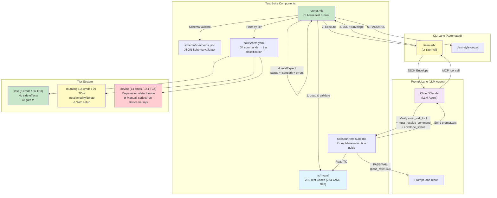
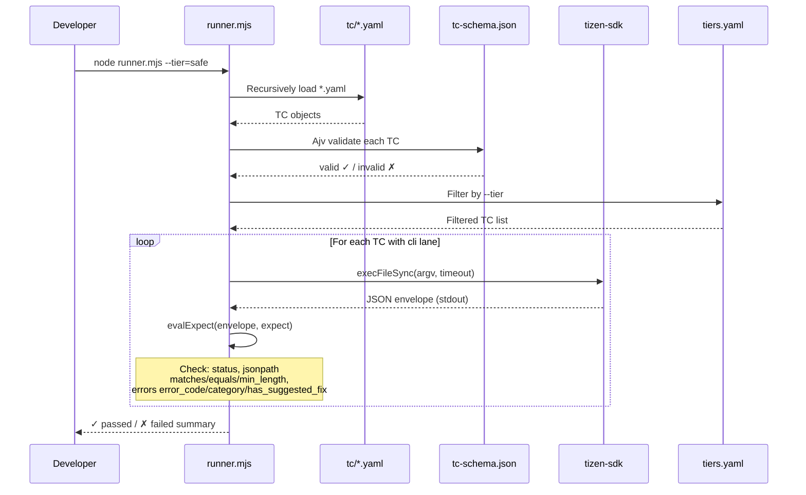
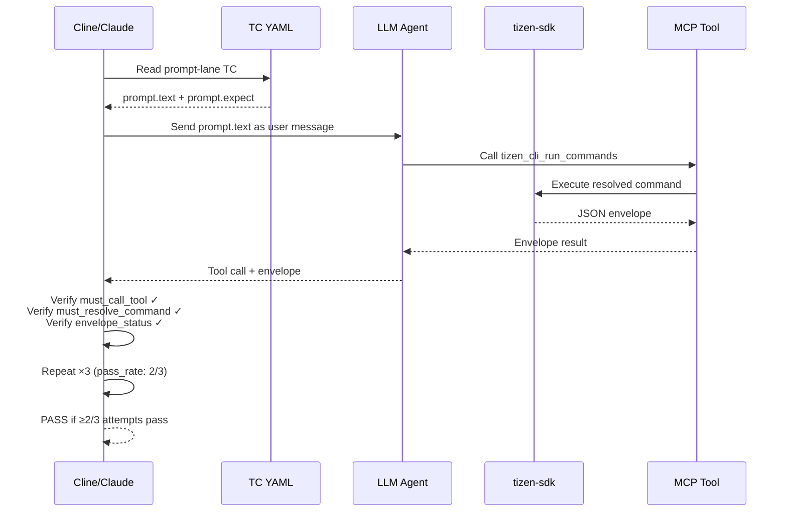
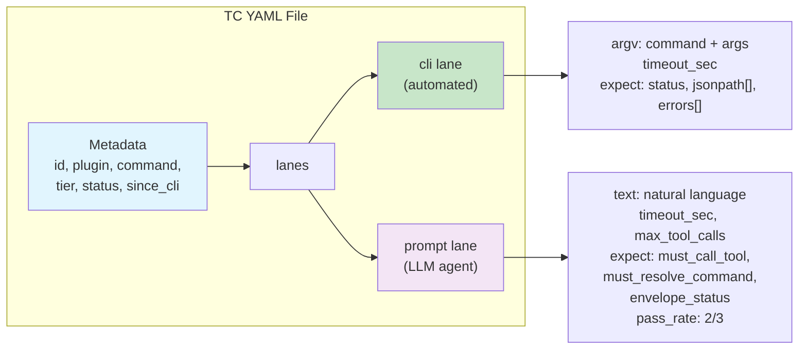

# tizen-sdk Test Suite

Self-contained test suite for the `tizen-sdk` plugin. Verifies that each of the 34 plugin commands produces the correct JSON envelope output and that LLM agents (Cline, Claude, tizen-cli) resolve natural-language prompts to the correct commands.

**286 test cases** across 8 domains, covering 33 of the 34 commands plus CLI meta-interfaces (`--capabilities`, `--doctor`, `--schema`). `tv-sdk-install-from-zip` is classified in `policy/tiers.yaml` (mutating) but has no TCs yet.

## Architecture Diagram



### CLI Lane Flow (runner.mjs)



### Prompt Lane Flow (Cline/Claude)



### TC YAML Structure



## Quick Start

```bash
cd tests
npm install
node runner.mjs              # run all TCs
node runner.mjs --tier=safe  # only safe-tier (no side effects)
node runner.mjs --dry-run    # validate TCs without executing
```

## What This Tests

| Layer           | TCs | What                                   | How                                                                                      |
| --------------- | --- | -------------------------------------- | ---------------------------------------------------------------------------------------- |
| **cli lane**    | 171 | Command produces correct envelope      | `runner.mjs` executes `tizen-sdk <command>` and checks status, jsonpath, errors          |
| **prompt lane** | 118 | LLM resolves prompt to correct command | Cline/Claude reads TC, sends prompt, verifies tool call (see `skills/run-test-suite.md`) |

8 TCs define both lanes, so the lane counts sum to more than 281.

### vs. Existing Unit Tests (`common/lib/tests/`)

|             | Unit Tests                 | This Suite                 |
| ----------- | -------------------------- | -------------------------- |
| Scope       | Individual functions       | Complete commands          |
| Environment | Node.js only               | tizen-cli + plugin         |
| LLM         | Not tested                 | Prompt resolution verified |
| Purpose     | Regression during refactor | Release quality gate       |

## Directory Structure

```
tests/
  README.md               ← this file
  TEST-SUITE-PLAN.md      ← design document
  CSV-YAML-MAPPING.md     ← CSV TC ID ↔ YAML traceability table
  package.json            ← dependencies (yaml, ajv)
  runner.mjs              ← cli-lane test runner
  schema/
    tc-schema.json        ← TC YAML JSON Schema
  policy/
    tiers.yaml            ← 34 commands classified by tier
    device-run-order.yaml    ← phased run order for the device tier (see "Device tier")
    mutating-run-order.yaml  ← phased run order for the mutating tier (see "Mutating tier")
  fixtures/               ← committed state files (test cert, profiles.xml) for mutating TCs
    fixtures.env          ← values for ${NAME} argv placeholders (keeps passwords off argv)
    apps/                 ← (gitignored) fixture apps, tmp/ + projects/ scratch dirs and
                             fixtures.generated.env, built by scripts/prepare-device-fixtures.mjs
  scripts/
    verify-doc-stats.mjs  ← CI gate: doc statistics must match actual TC files
    runner-helpers.test.mjs      ← unit tests for runner.mjs helpers + order-file consistency
    prepare-device-fixtures.mjs  ← builds/signs the fixture apps, tmp/ + projects/ dirs, playwright project
    run-device-tier.mjs          ← ordered, self-cleaning device-tier run (see "Device tier")
    run-mutating-tier.mjs        ← ordered, self-cleaning mutating-tier run (see "Mutating tier")
    lib/driver-common.mjs        ← shared helpers of the three scripts above (incl. FIXTURE_NEEDS)
  tc/                     ← 286 test cases in 279 YAML files
    device/               ← 103 TCs (create-emulator, launch-emulator, emulator-manager,
                                     device-manager, install-app, file-transfer,
                                     remote-device, screenshot, sdb-helper)
    sdk/                  ←  66 TCs (check-node, check-disk-space, sdk-init, sdk-install,
                                     sdk-install-custom-repo, tv-sdk-install, sdk-repo-info,
                                     validate-repo-url, update-package, platform-install,
                                     download-emulator-package, download-mobile-platform,
                                     install-rootstrap, dotnet-setup)
    debug/                ←  32 TCs (gdb-debug, dotnet-debug, webapp-debug)
    project/              ←  26 TCs (create-project, build-project, project-delete,
                                     list-templates)
    certificate/          ←  25 TCs (certificate-manager actions)
    meta/                 ←  16 TCs (--capabilities, --doctor, --schema, list-commands,
                                     no-args, guard-rules)
    test/                 ←  15 TCs (playwright-test)
    dlog-analyzer/        ←   3 TCs (dlog-analyzer)
  skills/
    run-test-suite.md     ← Cline/Claude prompt-lane execution guide
```

## TC Patterns

| Pattern                   | Description                                                             |
| ------------------------- | ----------------------------------------------------------------------- |
| `*.happy.yaml`            | Normal execution → expect `status: success`                             |
| `*.missing-required.yaml` | Required option omitted → expect `status: failure` + `invalid_argument` |
| `*.invalid-type.yaml`     | Invalid choice value → expect `status: failure`                         |
| `*.invalid-path.yaml`     | Non-existent path → expect `status: failure`                            |
| `*.prompt-happy.yaml`     | LLM prompt resolution → verify tool call + command                      |
| `*.scan-happy.yaml`       | Network scan → expect `status: success`                                 |

## Runner Options

```
node runner.mjs                    # run all TCs
node runner.mjs --tier=safe        # only safe-tier TCs
node runner.mjs --tier=mutating    # only mutating-tier TCs
node runner.mjs --tier=device      # only device-tier TCs
node runner.mjs --dry-run          # validate TCs without executing commands
node runner.mjs --tc=check-node    # filter by TC id substring
node runner.mjs --domain=sdk       # filter by domain directory
node runner.mjs --status=approved  # only verified TCs (regression gate)
node runner.mjs --skip-requires=sdk,net
                                   # skip TCs whose requires.capabilities need
                                   # something this host lacks (see below)
node runner.mjs --order=policy/<tier>-run-order.yaml [--phase=<name>]
                                   # run the listed TC ids in that order (repeats
                                   # allowed) instead of readdir order (see "Device tier"
                                   # and "Mutating tier")
node runner.mjs --help             # usage
```

`quarantined` TCs are excluded unless selected explicitly with `--status=quarantined`.
An unknown option (or a typo such as `--tier safe` without `=`) aborts the run with exit 2
instead of silently running every TC.

Without `--order` TCs run in readdir order: directory by directory (`certificate`, `debug`,
`device`, …), files alphabetically, strictly sequential, with no setup or teardown. That is
fine for the safe tier and self-destructive for the device tier (next section).

### Device tier: `scripts/run-device-tier.mjs`

Do not run `node runner.mjs --tier=device` bare. In readdir order the 16 debug TCs run before
any emulator exists, the three `create-emulator` TCs all create `test-vm` (em-cli refuses a
duplicate name), `emulator-manager.delete` sorts before `.detail`/`.modify-ram`/`.reset` and
before `launch-emulator.happy`, `device-manager.stop` sorts before `device-manager.timeout`,
and the remote-device bookmark chain edits an IP before the TCs that look it up. The run
cannot pass on any host.

The order that does pass lives in `policy/device-run-order.yaml` (the same id may appear more
than once, e.g. `emulator-manager.delete` between the create TCs), and
`scripts/run-device-tier.mjs` drives it:

```bash
cd tests
node scripts/prepare-device-fixtures.mjs    # once per host: build the fixture apps (6-12 min, see below)
node scripts/run-device-tier.mjs            # preflight + print the plan, change nothing
node scripts/run-device-tier.mjs --yes      # run all phases (~20 min, destructive — see below)
node scripts/run-device-tier.mjs --yes --include-drafts    # promotion run: also execute the draft
                                                           # TCs the order file lists
node scripts/run-device-tier.mjs --yes --skip-tv-boot      # skip the tv-vm boot; device-manager.tv fails
node scripts/run-device-tier.mjs --yes --phase=e-network   # one phase, no VM pre-clean/teardown
npm run prepare:device                       # = prepare-device-fixtures.mjs
npm run test:device                          # = plan only
```

| Phase | TCs | Precondition / hook |
| --- | --- | --- |
| `a-no-device` | missing-required, list-*, handoff envelopes | nothing booted |
| `b-vm-lifecycle` | create/detail/modify/reset/delete `test-vm`, `create-image` | VM stopped; hook `resetImageDir` empties `${FIXTURE_TMP_DIR}/emulator-images` |
| `c-boot-1` | `create-emulator.launch`, device-manager, screenshot, sdb-helper | boots `test-vm` and **leaves it running** for c2–c6 |
| `c2-fixture-apps` | install-app ×3 (native package; `.run` leaves the app running), file-transfer push/pull, `screenshot.output-path` | hook `deviceFixtures`: `sdb root on`, `install-app` the .NET/web fixture packages, write `/tmp/log.txt` |
| `c3-web-debug` | webapp-debug ×4, playwright-test ×6 | hooks `debugCleanup`, `resetTestProject` (scaffold refuses an existing test file) |
| `c4-dotnet-debug` | dotnet-debug ×5 | hook `debugCleanup` |
| `c5a` / `c5b` / `c5c` / `c5d` | gdb-debug launch / attach / breakpoints / `--serial`, one per phase | hook `debugCleanup` before each: attach mode resolves the PID with `pidof <exec>` before it kills a stale gdbserver |
| `c6-stop` | `device-manager.stop` | hook `debugCleanup` |
| `d-boot-2` | launch-emulator happy / first-available, stop, delete | only `test-vm` exists |
| `e-network` | remote-device bookmark chain, scans | hook `stripBookmarksHook` |
| `f1-tv-create`, `f2-tv-detect` | `create-emulator.tv`, `device-manager.tv` | hook `bootTvVm` between them |

**Fixtures** (`scripts/prepare-device-fixtures.mjs`, idempotent, `--skip-build` / `--only=…` /
`--clean`): the c2–c5 TCs and `create-image` use `${FIXTURE_*}` argv placeholders instead of the
Linux `/tmp/...` paths and hardcoded app ids they were authored with. The script creates and
Debug-builds a native BasicUI, a .NET TizenNUITemplate and a web Basic project under
`fixtures/apps/` (gitignored), signed with `myProfile` — created from
`fixtures/certs/test-fixture-author.p12` when missing, kept when it already uses that cert, and
left alone with an error when it points at another certificate unless `--replace-profile` is
passed —, reads the app ids
back from `tizen-manifest.xml` / `config.xml` (the plugin cannot pin them: web ids get a random
10-char package prefix), lays out `tmp/` (`config.xml`, `logs/`, `shots/`, `emulator-images/`,
`test-project/` with `npm install playwright`), and writes the absolute values to
`fixtures/apps/fixtures.generated.env`. The driver merges that file into the runner's environment
and, per phase, refuses to start when a key that phase needs is unset or points at a missing
file (`FIXTURE_NEEDS` in `scripts/lib/driver-common.mjs`; `runner-helpers.test.mjs` checks the
table against the placeholders the TCs actually use). `fixtures/fixtures.env` only holds
documentation defaults for the placeholder names. See `fixtures/README.md`.

What the driver adds around the runner:

- **Preflight**: `tizen-cli/dist/tizen-sdk.js` newer than `common/lib`, `common/scripts`,
  `tizen-cli/src` (else: `cd tizen-cli && pnpm build`); `tizen-sdk --doctor` has no failing
  check; SDK and data paths resolve; `check-whpx.exe` / `check-hax.exe` output (informational
  only — the plugin never probes the hypervisor, a missing one shows up as a boot timeout);
  no emulator online; `fixtures.generated.env` present and its artifacts exist.
- **Backup / pre-clean** (`--yes`): copies the Device Manager bookmark list
  (`<sdk-data>/device-manager/config/remote_device_scan.list`) into the scratch dir; deletes
  `test-vm` and `tv-vm` (the TCs create both).
- **Hooks** (table above; `PHASE_HOOKS` in the script): each runs right before its phase, also
  in a `--phase=<name>` run, and reports whether it established the precondition — a hook
  failure is listed in the summary and makes the run exit 1 even when the phase's TCs pass.
  `debugCleanup` = `sdb forward --remove-all` plus
  `pkill -f netcoredbg; pkill gdbserver; pkill <native exec>; app_launcher -t <fixture ids>`
  on the device — every debug TC forwards a host port (9222/9223, 4711, 5039) and leaves the
  app under a debugger.
- **Teardown** (always: after a failed phase, an exception, or Ctrl+C, each step attempted even
  if the previous one failed): `device-manager --action stop`, delete `test-vm` (unless
  `--keep-test-vm`), keep `tv-vm`, restore the bookmark list last. With `--phase=<name>` the
  VM pre-clean and VM teardown are skipped (the hooks of that phase still run and the bookmark
  list is still restored); a lone `--phase=c-boot-1` leaves `test-vm` running.
- Runs the runner from a scratch cwd (`screenshot.*` write `./emulator_screenshot.png`) and
  tees everything into `<scratch>/run.log`.

Destructive with `--yes`: deletes and recreates the VMs `test-vm` and `tv-vm`, factory-resets
`test-vm`, stops **every** running emulator, sweeps the local /24 on TCP 26101 three times
(`remote-device scan`), rewrites the bookmark list (restored afterwards), and installs,
launches and kills the fixture apps on `test-vm`. `sdb-helper "reboot the device"` is a gated
intent and only previews the command.

Invariants the order relies on: at most one emulator online while device-bound TCs run
(`resolveSerial` returns `multiple_devices` for two; `screenshot.serial` asserts
`emulator-26101`), `tv-vm` must not exist before `f1` (`launch-emulator.first-available` boots
whatever em-cli lists first), `reset`/`delete`/`modify`/`create-image` need the VM stopped, and
`playwright-test.no-setup` must directly follow `.run` (it reuses the CDP forward on 9222).
Validate an edit to the order file with
`node runner.mjs --dry-run --tier=device --order=policy/device-run-order.yaml` — an id that is
misspelled or ambiguous aborts with exit 2 (add `--status=approved` to also reject drafts), and
`scripts/runner-helpers.test.mjs` checks that every approved device TC is listed.

Two `draft` device TCs stay outside the run on purpose: `remote-device.connect` /
`.connect-custom-port` need a Tizen device reachable over the network (`127.0.0.1` would
duplicate the emulator's sdb row and break `resolveSerial`); they declare
`requires.capabilities: [net-device]`. `file-transfer.prompt-pull-missing` has no cli lane and
is run by an agent session (see `skills/run-test-suite.md`) with `test-vm` booted.

### Mutating tier: `scripts/run-mutating-tier.mjs`

`node runner.mjs --tier=mutating` bare cannot pass either: `build-project.*` sorts before the
`create-project` TC that makes the project it builds, `project-delete.happy` sorts before the
later builds, `certificate-manager.remove-profile` consumes its fixture `profiles.xml`, and
`generate-author` / `import-certificate` refuse to overwrite what a previous run left in
`<sdk-data>/keystore/`. `policy/mutating-run-order.yaml` orders the TCs a provisioned host can
run without installing anything, and `scripts/run-mutating-tier.mjs` drives it:

```bash
cd tests
node scripts/prepare-device-fixtures.mjs --only=tmp,projects   # scratch dirs + fixtures.generated.env
node scripts/run-mutating-tier.mjs            # preflight + plan, changes nothing
node scripts/run-mutating-tier.mjs --yes      # ~5 min; see "destructive" below
node scripts/run-mutating-tier.mjs --yes --include-drafts     # promotion run
node scripts/run-mutating-tier.mjs --yes --phase=k3-cert-profiles
npm run prepare:mutating / npm run test:mutating
```

| Phase | TCs | Precondition / hook |
| --- | --- | --- |
| `s1-sdk-idempotent` | `sdk-install.happy/.specific-version/.custom-repo`, `sdk-install-custom-repo.happy/.specific-version`, `tv-sdk-install.happy`, `dotnet-setup.happy/.specific-version` | an installed SDK: every command takes its already-installed short-circuit (no download); the `--repo-url` TCs validate `${TC_CUSTOM_REPO_URL}` over the network first |
| `k1-cert-readonly` | `list-profiles`, `list-distributors`, `inspect-certificate` | — |
| `k2-cert-keystore` | `generate-author` ×3, `import-certificate` ×2 | hook `cleanKeystore`: removes `author/{TestDev,Jane-Dev,TestDev-v2,test-fixture-author}.*` and `distributor/test-fixture-author.*` under `<sdk-data>/keystore` (only these names) |
| `k3-cert-profiles` | `create-profile`, `set-active-profile`, `remove-profile` | hook `resetProfileFixtures`: restores `fixtures/profiles/*.xml` from the run's backup, deletes the scratch `${FIXTURE_TMP_DIR}/profiles/created-profiles.xml` that `create-profile` writes (never the SDK's real `profiles.xml`) |
| `p1-projects` | `create-project.native-happy/.webapp-happy/.dotnet-happy/.force` (`.force` twice — the second run is the real overwrite), `build-project.happy/.clean/.release`, `project-delete.happy` | hook `resetProjectsDir` empties `${FIXTURE_PROJECTS_DIR}`; the builds target the `MyNativeApp` the first TC creates and sign with the `myProfile` the prepare script made |

The driver runs the runner with **cwd = `tests/`** (the certificate TCs use `fixtures/...`
relative paths), gates on `fixtures.generated.env` per phase like the device driver, refuses to
start while `fixtures/profiles` has uncommitted changes (the teardown restores the backup over
them), and always tears down: profile fixtures restored, scratch `profiles.xml` deleted,
`cleanKeystore` again, then a `git status` self-check that the fixtures are clean. A second
Ctrl+C during the teardown is ignored (it would otherwise kill the process mid-restore), and a
teardown step that fails is listed in the summary and fails the run. Every directory a hook
empties (`${FIXTURE_PROJECTS_DIR}` here, `emulator-images/` and `test-project/` in the device
driver) goes through `guardedScratchDir()` in `scripts/lib/driver-common.mjs`: the real path
must lie strictly inside `tests/fixtures/apps`, must not be a symlink/junction, and may not sit
on another drive — the values come from a user-editable env file. Destructive with `--yes`: exactly those keystore files and fixture
rewrites, plus whatever the `sdk-install` / `tv-sdk-install` short-circuits touch
(`sdk.info`, `~/.tizen.sdk.path.config`). It never installs or removes SDK packages.

Mutating cli-lane TCs that stay `draft`, with the reason in their `NOTE` and a `requires`
declaration: the SDK installers that only execute under the packaged CLI (`process.pkg`) or
reinstall the host's SDK (`sdk-install.force`, `sdk-install-custom-repo.force`,
`tv-sdk-install.force`, `dotnet-setup.force`, `update-package.*`, `platform-install.happy`,
`download-emulator-package.*`, `download-mobile-platform.*`, `install-rootstrap.happy` —
`requires: [sdk, net]`), the Samsung online-CA actions (`samsung-login`,
`generate-samsung-author/-distributor` — `[sdk, samsung-account]`), the GBS builds
(`build-project.arch` / `.gbs` — `[sdk, gbs]`, Linux only) and `build-project.compiler-flags`
(no compiler-flag passthrough exists; the trailing token is silently dropped).

### CI gate

`.github/workflows/ci.yml` runs the safe tier on every PR:

```bash
HOME=<throwaway dir> node runner.mjs --tier=safe --status=approved --skip-requires=sdk,net
```

The CI runner has no Tizen SDK and no guaranteed route to `download.tizen.org`, so a TC
that needs either declares it and is reported as `⊘ … (requires sdk — skip)` instead of
failing:

```yaml
requires:
  capabilities: [sdk] # or [net]
```

| Capability | Meaning                                                                | Declared by                                                                                            |
| ---------- | ---------------------------------------------------------------------- | ------------------------------------------------------------------------------------------------------ |
| `sdk`      | An installed Tizen SDK (templates, `sdk.info`, keystore, default path) | `list-templates.*`, `sdk-init.happy`, `sdk-install.unavailable-version`, `certificate-manager.*.happy` |
| `net`      | Outbound access to `download.tizen.org`                                | `validate-repo-url.happy`, the `--repo-url` and SDK-installer TCs                                     |
| `net-device` | A Tizen device reachable over the LAN (`sdb connect`)                | `remote-device.connect`, `.connect-custom-port`                                                        |
| `samsung-account` | A logged-in Samsung account for the online CA                   | `certificate-manager.samsung-login`, `.generate-samsung-author`, `.generate-samsung-distributor`       |
| `gbs`      | A Linux host with the GBS toolchain and `~/GBS-ROOT` (platform builds) | `build-project.arch`, `build-project.gbs`                                                              |

`--skip-requires` is a declaration about the host, not a probe — the runner never checks
whether the SDK is really absent. The CI step checks it instead: it fails before running
anything if `~/.tizen.sdk.path.config`, `~/tizen-sdk` (under the throwaway `HOME`) or an
`sdb` on PATH exists, so the `sdk` TCs are never skipped on a host that could run them. The
summary line breaks skips down by reason (`requires sdk: 6, requires net: 1, no cli lane: 13`)
for the same reason. Before promoting a safe TC to `approved`, run the gate
command above locally with an empty `HOME` (the redirect also keeps
`sdk-init.explicit-path` from overwriting your real `~/.tizen.sdk.path.config`) and either
make the TC pass without an SDK or add the `requires` block.

**Windows:** Node's `os.homedir()` reads `USERPROFILE`, not `HOME`, so redirect that one —
`USERPROFILE=<throwaway dir> node runner.mjs --tier=safe …` (PowerShell: `$env:USERPROFILE = …`).
With only `HOME` set, `sdk-init.explicit-path` writes `/tmp` into your real
`~/.tizen.sdk.path.config` and every later sdb-based command fails with a `\tmp\tools\sdb.exe`
path; repair with `tizen-sdk sdk-init --sdk-path <your SDK dir>`.

## Status Classification

`tier` says what a TC needs in order to run; `status` says how far it has been verified.

| Status        | Count | Meaning                                                            |
| ------------- | ----- | ------------------------------------------------------------------ |
| `draft`       | 22    | Authored, never executed — assertions unproven                     |
| `candidate`   | 0     | Executed and passing, but not every lane verified yet              |
| `approved`    | 264   | Every lane executed and passing; a regression is a release blocker |
| `quarantined` | 0     | Known unstable or environment-broken; excluded by default          |

Schema validation (`--dry-run`) never justifies a promotion — it only checks the YAML shape.

## Tier Classification

| Tier      | Commands | TCs     | Description              | CI-safe?      |
| --------- | -------- | ------- | ------------------------ | ------------- |
| safe      | 6        | 66      | No side effects          | ✅ Yes        |
| mutating  | 14       | 79      | Install/modify/delete    | ⚠️ With setup |
| device    | 14       | 141     | Requires emulator/device | ❌ Manual     |
| **Total** | **34**   | **286** |                          |               |

See `policy/tiers.yaml` for the full classification. CI runs the `approved` safe TCs on
every PR (see "CI gate" under Runner Options); the device tier is run manually through
`scripts/run-device-tier.mjs` (see "Device tier" under Runner Options); the mutating tier
is run manually with `--tier=mutating` plus the fixtures in `fixtures/`.

## Adding a New TC

1. Create a YAML file in the appropriate `tc/<domain>/` directory
2. Follow the schema in `schema/tc-schema.json`
3. Use the naming convention: `<command>.<variant>.yaml`
4. Validate with `node runner.mjs --dry-run`; for a `safe` TC also run the CI gate command
   (see "CI gate" above) with an empty `HOME` (`USERPROFILE` on Windows), and add `requires.capabilities: [sdk]` or
   `[net]` if the TC cannot pass without an installed SDK or outbound network
5. Update the counts in this README and `CSV-YAML-MAPPING.md` — CI runs
   `scripts/verify-doc-stats.mjs`, which fails if the documented statistics
   drift from the actual TC files
6. Never put passwords or other credential-shaped values literally in `argv`
   (security scanners flag them) — use a `${NAME}` placeholder and define the
   value in `fixtures/fixtures.env` as a base64-encoded `NAME_B64=` entry
   (the runner decodes it and exposes `${NAME}`); the runner expands
   placeholders at exec time from fixtures.env → process env → the TC's
   `env:` block. Avoid `PASSWORD`-like substrings in the key name itself

Example:

```yaml
id: tizen-sdk.check-node.happy
plugin: tizen-sdk
command: check-node
tier: safe
status: draft
since_cli: 1.0.0

lanes:
  cli:
    argv: ["tizen-sdk", "check-node"]
    timeout_sec: 30
    expect:
      status: success
      jsonpath:
        - { path: "$.result.node_version", matches: "^v\\d+" }
```

## Running Prompt-Lane TCs in Cline/Claude

See `skills/run-test-suite.md` for instructions on how Cline or Claude agents execute prompt-lane TCs by reading the TC YAML and simulating the user prompt.

## Prerequisites

- Node.js >= 20
- For cli-lane execution, one of:
  - `tizen-cli` on PATH with the `tizen-sdk` plugin installed, or
  - the standalone launcher `tizen-sdk` on PATH (`cd tizen-cli && pnpm build && pnpm add -g .`; pnpm 10 removed `pnpm link --global` and pnpm 11 removed the bare `pnpm link`) — the runner falls back to it when `tizen-cli` is absent
- For `--dry-run` mode: no runtime needed, just Node.js + npm dependencies
